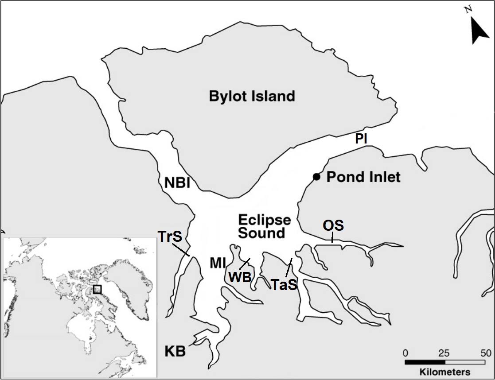

<!-- To be able to have continuous line numbers -->

```{=html}
<style>
body
  { counter-reset: source-line 0; }
pre.numberSource code
  { counter-reset: none; }
</style>
```
# Tutorial objectives

In yesterday's tutorial, we illustrated how to fit a basic HMM to high quality animal movement data to identify behaviours, and how to incorporate covariates on the state transition probability to identify conditions that promote different behaviours. In this tutorial, we will discuss methods to address missing data, which is very common in marine tracking data, how to integrate additional data streams (specifically, diving data), and incorporate covariates on the emission probabilities (e.g., step length depending on current speed). Specifically, we aim to address the following:

1. Selecting an appropriate resolution for the data
2. Interpolating missing locations
    - Linear and correlated random walk interpolation 
    - Voiding data gaps 
    - Path segmentation 
    - Multiple imputation
3. Incorporating diving data-streams
4. Incorporating covariates on emission probabilities

In this tutorial, will be using two weeks of tracking data for three narwhal provided by Dr. Marianne Marcoux.

# Setup workspace

First, we'll setup the workspace with required packages.

```{r import_libraries, message=FALSE, attr.source = ".numberLines"}
library(dplyr)     # data management
library(tidyr)     # data management
library(stringr)   # character string management
library(data.table)# data management
library(lubridate) # date management
library(units)     # physical measurement units management
library(sf)        # spatial data processing
library(terra)     # raster data processing
library(tmap)      # mapping spatial data
library(diveMove)  # calculating dive metrics 
library(earthtide) # estimating tidal data 
library(corrplot)  # calculating Pearson's correlation matrices
library(momentuHMM)# fitting HMMs
library(conicfit)  # fitting error ellipses (required by momentuHMM)
library(car)       # additional operations to Applied Regression
library(mitools)   # parallel processing
library(doFuture)  # parallel processing
library(kableExtra)# produce visually appealing tables
```

Make sure to set working directory to "Day2" of the HMM workshop folder:

```{r, eval=FALSE, message=FALSE, attr.source = ".numberLines"}
setwd("Day2")
```

# Import data and initial data processing

First, let's import the narwhal movement data. For simplicity, we will only examine data from two weeks in August 2017 for three individuals.

```{r import_tracks, message=FALSE, attr.source = ".numberLines"}
tracks <- read.csv("data/tracks.csv") %>%
  mutate(time = ymd_hms(time)) # define time
```

The data we obtain is often quite messy with some records missing information and other records duplicated. We can filter records to keep only complete location data using `!is.na(x) & !is.na(y)`. To remove duplicate records (same time, location, and location class), we will use the `lag` function from `dplyr`, which will use the value from the previous row so that we can compare to the current row.

```{r remove_missing_or_duplicate_data, message = FALSE, attr.source = ".numberLines"}
tracks <- tracks %>% 
  # remove missing locations
  filter(!is.na(x) & !is.na(y),
         # remove identical records
         !(time == lag(time) & x == lag(x) & y == lag(y) & loc_class == lag(loc_class)))
```

Next, we'll convert the data to a spatial dataset using the `sf` package and plot the data. First, we define the coordinate reference system of the original data (in this case WGS84, which is defined by the EPSG code `4326`). Next, we will project the data into NAD83(CSRS) UTM zone 21N (`EPSG:2962`), which will be projecting the coordinates in meter units with minimal distortion for this data set.

```{r define_projection, message=FALSE, attr.source = ".numberLines"}
tracks_proj <- tracks %>%
  st_as_sf(coords = c("x", "y")) %>% # converts to an sf object
  st_set_crs(4326) %>% # define CRS
  st_transform(2962) # reproject data to a UTM
```

For the main tutorial, we'll use only the fastloc GPS data so we don't have to deal with location error.

```{r filter_gps_data, message=FALSE, attr.source = ".numberLines"}
# filter GPS locations only
tracks_gps <- tracks_proj %>% 
  filter(loc_class=="GPS")
```

We lose some data, particularly near the end of the tracks.  Additional processing and integration of ARGOS data is provided as a bonus at the end.

Now, we can map the data using the `tmap` package to visualize what it looks like. We first have to group the data by narwhal ID, and then cast the data type to `LINESTRING` to create paths.

```{r plot_gps_data, message=FALSE, attr.source = ".numberLines"}
# plot GPS
tracks_gps %>%
  group_by(ID) %>% # group by ID
  summarise(do_union = FALSE) %>%
  st_cast("LINESTRING") %>% # convert data type
  tm_shape() +
  tm_lines(col = "ID", palette = "Dark2")
```

# Selecting a time interval for the HMM

The classic HMM assumes the observations are collected in discrete time and that there is no missing data in the predictor variables. There are two key decisions we must make, the temporal resolution to use, and how to address data gaps. The desired resolution depends predominantly on the biological question you are asking as different behaviours and biological processes occur at different spatial and temporal scales (e.g., seasonal migration, daily movement between foraging and resting grounds, and fine scale foraging decisions). Generally, higher resolution data is preferred as it has more information. However, it is possible to have too-high of a resolution wherein information from fine-scale variability drowns out the signal from coarse-scale patterns of interest (e.g., seasonal migration). In this case, we will be linking the movement data with high resolution (75 s) dive data to look at finer-scale behaviours (on the order of a few hours). My rule of thumb, is that you want 3-50 data points per behaviour. For behaviours spanning several hours, that roughly corresponds to a desired resolution between 2 min and 60 min.

First, let's calculate the time difference between successive records using `difftime` and `lead` (compares current row to following row) and place these values in a new column called `dt`. Note that the time difference is in minutes (`units = "mins"`). For the last record of each individual (i.e., when `ID != lead(ID)`), we will set the value to `NA`.

```{r calc_dt, attr.source = ".numberLines"}
# Calculate time difference between locations
tracks_gps <- tracks_gps %>%
  mutate(dt = ifelse(ID == lead(ID), # If next data row is same individual
                      # calculate time difference
                     difftime(lead(time), time, units = "mins"), NA))
```

Let's see what resolutions may be possible in the data by looking at the most frequent time gaps.

```{r calc_track_dt, attr.source = ".numberLines", collapse=TRUE}
# Visualise time differences
hist(tracks_gps$dt, 1000, main = NA, xlab = "Time difference (min)")
# Zoom in on short intervals
hist(tracks_gps$dt, 1000, main = NA, xlab = "Time difference (min)", xlim = c(0,100))
# identify the most frequent dt
tracks_gps %>% 
  {table(.$dt)} %>% 
  sort(decreasing = TRUE) %>% 
  head()
```

We see that the most frequent time gap is 10 min, followed by 11, 12, 22, 9, and 13 min. We also see the majority of the gaps are \< 60 min, however some are in excess of 600 min. Because HMMs assume observations taken at regular time intervals, finer resolutions will contain more data gaps that would need to be interpolated. Frequent and large data gaps can be difficult to handle, especially as the number of missing data points approaches or exceeds the existing data. Let's examine the potential data structure at different resolutions for the different animals.

We first create a function that approximates the proportion of missing locations we would have for a given resolution.

```{r proportion_NA_fx, attr.source = ".numberLines"}
# Make function to estimate proportion of missing locations 
p_na <- function(time, res) {
  time <- round_date(time, paste(res,"min")) # round to nearest resolution
  time <- na.omit(time[time != lead(time)]) # remove duplicate time
  # calculate maximum number of locations          
  max_n_loc <- length(seq(time[1], tail(time, 1) + res*60, 
                          by = as.difftime(res, units = "mins")))
  n_NA <- max_n_loc - (length(time)+1)
  n_NA / max_n_loc
}
```

We can now use this function to look at the proportion of NAs we would get with 10, 20, 30, and 60 min resolution.

```{r track_resolution_proportion_NA, attr.source = ".numberLines"}
# summarise track dt
tracks_gps %>% 
  st_drop_geometry() %>% 
  group_by(ID) %>% 
  summarise(p_NA_10m = p_na(time, 10),     # 10 min 
            p_NA_20m = p_na(time, 20),     # 20 min 
            p_NA_30m = p_na(time, 30),     # 30 min 
            p_NA_60m = p_na(time, 60)) %>% # 60 min
  # return formatted table
  kable(digits = 3, col.names = c("Narwhal ID", paste(c(10,20,30,60), "m"))) %>%
  kable_styling() %>% 
  add_header_above(c("", "Resolution" = 4))
```

Here we see that the 10 min interval, around 50% of the locations would be missing. This is the limit that I would be comfortable at, since at finer resolutions, simulated data would outweigh real data, and may bias the results. 
We will be able to exclude very large data gaps that contribute large numbers of missing locations, and therefore, for this tutorial, I will use a 10 min resolution.

# Handling data gaps

There are several ways to deal with data gaps, and I will address four:

1.  Interpolation (linear and correlated random walk)
2.  Voiding data gaps
3.  Path segmentation
4.  Multiple imputation

Some of these methods will not work on data with multiple individuals. To get around this, we can split the data into a list where each element of the list is the location data for each ID. We can use the `R` apply family functions to apply functions to each animal separately. 

```{r convert_tracks_to_list, attr.source = ".numberLines"}
# convert tracks back to data.frame with xy coordinates
tracks_gps_ls <- tracks_gps %>% 
  # recreate x and y columns and drop sf geometry
  mutate(x = st_coordinates(tracks_gps)[,"X"],  
         y = st_coordinates(tracks_gps)[,"Y"]) %>%
  st_drop_geometry() %>% 
  split(.,.$ID)  # split into list
```

## Approach 1: Interpolation

### Linear interpolation

For large datasets with few and small gaps, the simplest approach is to use linear interpolation. First, let's identify the minute for which we have most of the data.

```{r identify_most_freq_dt, attr.source = ".numberLines", message = FALSE, cache=TRUE}
# which minute has the most data
tracks_gps %>% 
  st_drop_geometry() %>%  # convert back to data.frame
  group_by(ID) %>% 
  summarise(minute = str_sub(minute(time), -1)) %>% # gets the last minute, e.g. str_sub("37", -1) returns 7
  table() %>% 
  # create formatted table
  kable() %>% kable_styling() %>% 
  add_header_above(c("Narwhal ID", "Minute" = 10))
```

It looks like for all three tracks, the most amount of locations fall on 0 min (i.e., 10, 20, 30, 40, 50, or 60 min). 

Next, for each track, we will create a vector of times in which to estimate locations. We will store the times for each animal as unique elements in a list.

```{r linear_interpolation_prep, message = FALSE, attr.source = ".numberLines"}
# create full time series on which to estimate locations rounded to the nearest 10 min
tracks_gps_ls_time <- tracks_gps %>% 
  st_drop_geometry() %>%  # convert to data.frame
  group_by(ID) %>%
  summarise(time = seq(round_date(first(time), "10 min"), 
                       round_date(last(time), "10 min"),
                       by = 60*10)) %>% 
  split(.,.$ID)  # split into list
```

Now, we can interpolate the locations for each track. We will first write a wrapper function to `approx` that will create a data frame of approximated locations at specified times.

```{r linear_interpolation_function, attr.source = ".numberLines"}
# function to create a data frame with approximated locations
approx_locs <- function(tracks, times){
  data.frame(ID = times$ID,
        time = times$time,
        x = approx(tracks$time, tracks$x,
                   xout = times$time)$y,
        y = approx(tracks$time, tracks$y,                               
                   xout = times$time)$y)
}
```

Next, we will apply our `approx_locs` function to estimate the locations for each animal using their respective regularised times. We can do this using the `mapply` function, which will map the function using each the following arguments as inputs to the specified function. That is, it will apply the `approx_locs` function iteratively to each element in the `tracks_gps_ls_time` and `tracks_gps_ls` lists. 

```{r linear_interpolation, attr.source = ".numberLines"}
# Interpolate the location at the times from the sequence
tracks_gps_linear <- mapply(approx_locs, tracks_gps_ls, tracks_gps_ls_time,
                            SIMPLIFY = FALSE) %>% 
  do.call("rbind", .)  # convert list of tracks back to a single data.frame

# remove row names added by rbind
rownames(tracks_gps_linear) <- NULL 

# plot locations
plot(tracks_gps_linear$x, tracks_gps_linear$y, pch = 20, col = "red", 
     xlab = "x", ylab = "y", asp = 1)
points(st_coordinates(tracks_gps)[,"X"], st_coordinates(tracks_gps)[,"Y"], pch = 20)
```

Looks like it works. Let's try fitting an HMM to this. 

#### Fit HMM to linearly interpolated data {#fit-lin-HMM}

First, lets prepare the data using `prepData` and plot the data to estimate starting parameters.

```{r linear_HMM_prep, attr.source = ".numberLines", cache=T}
prep_gps_linear <- prepData(tracks_gps_linear, type = "UTM")
# plot (just one animal)
plot(prep_gps_linear, ask = FALSE, animals = "T172062")
```

Note how you can see the sections where we linearly interpolated locations as a horizontal segment in step-length (e.g., around t = 100 and t = 250). 

Next, we must define our model structure and initial parameters and then fit the HMM.

```{r linear_HMM_pars_fit, attr.source = ".numberLines", cache=TRUE, message=FALSE}
# define states (optional)
stateNames <- c("resident", "travel")
nbState <- length(stateNames)
# define distribution to use for each data stream
dist <- list(step = "gamma", angle = "vm")

# Setting up the starting values
mu0 <- c(50, 500) # Mean step length
sigma0 <- mu0 # SD of the step length
kappa0 <- c(0.1, 1) # Turn angle concentration parameter
# combine starting parameters 
Par0 <- list(step = c(mu0, sigma0), angle = kappa0)

# Fit a 2 state HMM
set.seed(1)
HMM_gps_linear <- fitHMM(prep_gps_linear, nbState = nbState, dist = dist, Par0 = Par0, stateNames = stateNames)

# plot HMM output
plot(HMM_gps_linear, ask = FALSE, animals = "T172062")
plotPR(HMM_gps_linear)
```

The plotted states look relatively ok, however there is quite a weird flat section in the QQ-plot of the turning angle. In data with large linearly-interpolated gaps, the model often represents the original dynamic data as one state, and defines the straight interpolated segments with a second state. This is a common problem when data gaps are frequent or large such that the information in the interpolated data outweighs the signal from the original observations. Generally, I would only use linear interpolation when data gaps are small (\< 3 locations) and relatively infrequent (\< 20 % of the modelled locations). In our data, some gaps are \> 5 hours (30 locations) and \> 50% of the modelled locations are interpolated. So we need to use another approach. The flat section in the QQ-plot around 0 emerges because the model overestimates the values just below the middle quantile (in our case, $0^\circ$) and just above the middle quantile. In other words, our model is not capturing the large amount of turning angles really close to $0^\circ$ (this may be considered a good thing in our case since we know these are linearly interpolated). In addition, the model is under-estimating the prevalence of the lowest and highest turn angle quantiles.

### Correlated random walk interpolation {#stat-int}

A slightly better way to interpolate locations is to fit a continuous-time correlated random walk (CTCRW) model to the data and predict the most likely locations. `momentuHMM` contains wrapper functions to interpolate missing locations by fitting a CTCRW to the data based on the `crawl` package by Devin Johnson and Josh London. There are many options to fit the CTCRW model, and a detailed tutorial for analysis with `crawl` is available here: <https://jmlondon.github.io/crawl-workshop/crawl-practical.html>. Let's try to fit the most basic model using the wrapper function `crawlWrap`. In the most basic form, we only need to provide tracking data with the columns `ID`, `time`, `x`, and `y` and specify the desired temporal resolution. 

```{r crawl_10_min_gps, attr.source = ".numberLines", message=FALSE, cache=TRUE, collapse=TRUE}
# crawl can fail to fit periodically, so I recommend always setting a seed 
set.seed(5)

# fit crawl
crw_gps_10 <- crawlWrap(obsData = tracks_gps, timeStep = "10 mins")

# view that all parameters were properly estimated 
crw_gps_10$crwFits %>% 
  lapply(function(x){
    x[c("par","se","ci")] %>%  # get estimated values 
      unlist() %>%  # unlist
      is.nan() %>%  # identify values that failed to estimate
      sum() == 0 # count failed estimates and ensure there are 0
  }) 
# plot fit track (for just one track)
plot(crw_gps_10, ask = FALSE, animals = "T172062")
```

Notice how the predicted tracks do not make perfectly straight lines through missing sections (particularly noticeable in T172062).

#### Fit HMM to statistically interpolated data {#fit-crw-HMM}

Now, let's try to fit the same HMM as before on this data using the same model structure and starting parameters as the `HMM_gps_linear` HMM.

```{r crawl_HMM_fitHMM, message=FALSE, attr.source = ".numberLines", cache=TRUE}
set.seed(1)
# prep data 
prep_gps_crw <- prepData(crw_gps_10, type = "UTM")

# Fit a 2 state HMM
HMM_gps_crw <- fitHMM(prep_gps_crw, stateNames = stateNames,
                      nbState = nbState, dist = dist, Par0 = Par0)
# plot outputs (for one animal)
plot(HMM_gps_crw, ask = FALSE, animals = "T172062")
plotPR(HMM_gps_crw)
```

That's looking much better. It looks like state 1 represents a low-speed, high tortuosity resident state, while state 2 represents higher-speed, low tortuosity travelling state. The QQ plot for turn angle, in particular, has lost the flat section around the middle quantile. However, we also see that we are still underestimating the prevalence of high turn angles, though not to the same degree as in the linearly interpolated data.

For many applications, this model may be sufficient. However, the significant proportion of interpolated locations used to fit the model is likely to affect our results. For example, the large interpolated gaps are still relatively straightened out and a very consistent speed, and may skew the definition of state 2 in particular. Simply interpreting the results with this issue in mind can be adequate when we only have few interpolated locations. Below, we will explore more formal ways to address this problem, which can be particularly useful when we have very large numbers of interpolated locations.

For later stages in this tutorial, I want to use the tracks predicted using this CRW method, so we will extract the predicted locations and add them to the observed data.

```{r create_tracks_crw, message=FALSE, attr.source = ".numberLines"}
# filter predicted locations from predicted CRW model
tracks_gps_crw <- data.frame(crw_gps_10$crwPredict) %>% 
    filter(locType == "p") %>% 
    dplyr::select(mu.x, mu.y, time,
                  ID) %>% 
    dplyr::rename(x = "mu.x", y = "mu.y")
```


## Approach 2: Voiding data gaps {#void-gaps}

One strategy to address large data gaps is to void the data streams (i.e., step length and turning angle) during moderate/large interpolated gaps where we expect that the estimated movement is largely independent of the observed data before or after the gap. For my own work, I have typically voided sections with $>6$ missing locations. The maximum size of a gap to allow depends on the frequency of the missing data, frequency of locations, study species, and behaviours of interest. In this case, I will void the data streams from locations predicting in gaps $>60$ min. First, we will identify which steps need to be voided, then we will prepare the data and void the estimated `step` and `angle` data streams. We will do this again later in the tutorial, so we will wrap it into a function called `prepData_NAGaps`. The function will output a `momentuHMMData` object that can directly be fit using `fitHMM`.

```{r id_void_gaps, attr.source = ".numberLines"}
# define function to replace step and turn angle of large gaps with NA
NA_gaps <- function(tracks, times){
  # rows where location is within a large gap
  rows <- which(
    rowSums(apply(times, 1, function(X, tracks){
      dplyr::between(tracks, 
                     as.POSIXct(X[1], tz = "UTC"),
                     as.POSIXct(X[2], tz = "UTC"))
    }, tracks$time))==1)
  tracks$step[rows] <- NA
  tracks$angle[rows] <- NA
  return(tracks)
}
# define function to identify and void gaps
prepData_NAGaps <- function(track_list, tracks_crw, res, max_gap, ...){
  # for each ID, identify which rows have gaps >= max_gap 
  gaps_ls_rows <- lapply(track_list, function(x){
    which(difftime(lead(x$time), x$time, units = "mins") >= max_gap)
  })
  
  # create sequence of times for each track from gaps >= 60 min
  gap_ls <- mapply(FUN = function(track, gaps){
    # identify start and end date of each gap
    gaps_ls_srt_end <- list(start = ceiling_date(track$time[gaps], paste(res, "min")),
                            end = floor_date(track$time[gaps+1], paste(res, "min")))
    # combine into single vector for each track
    data.frame(start = gaps_ls_srt_end$start, end = gaps_ls_srt_end$end)
  },
  track_list, gaps_ls_rows, SIMPLIFY = FALSE)
  
  # prep data and list by ID
  prep_tracks <- prepData(tracks_crw, ...) %>% 
    {split(., .$ID)}
  
  # Interpolate the location at the times from the sequence
  mapply(FUN = NA_gaps, prep_tracks, gap_ls,
         SIMPLIFY = FALSE) %>% 
    do.call("rbind", .) # convert list of tracks back to a single data.frame
}

prep_tracks_gps_crw_NAgaps <- prepData_NAGaps(tracks_gps_ls, tracks_gps_crw, 
                                              10, 60, type = "UTM")
```

#### Fit HMM to CRW data with voided gaps

Now, let's try to fit the same HMM as in sections \@ref(fit-lin-HMM) and \@ref(fit-crw-HMM) to this data with large gaps voided.

```{r voided_crawl_HMM_fitHMM, message=FALSE, attr.source = ".numberLines", cache=TRUE}
set.seed(1)
# Fit a 2 state HMM
HMM_gps_crw_NAgaps <- fitHMM(prep_tracks_gps_crw_NAgaps, 
                             stateNames = stateNames, nbState = 2, 
                             dist = dist, Par0 = Par0)
# plot outputs (for one animal)
plot(HMM_gps_crw_NAgaps, ask = FALSE, animals = "T172062")
plotPR(HMM_gps_crw_NAgaps)
```

```{r, attr.source = ".numberLines", collapse=TRUE}
HMM_gps_crw$mle[c("step", "angle")]
HMM_gps_crw_NAgaps$mle[c("step", "angle")]
```

Visually, the difference is subtle. However, the estimated parameters are quite different whether you account for the large gaps in data. When you void large gaps, the mean step length for both states is higher, and the turn angle concentration parameters is lower for both states (i.e., more tortuous). The fact that the parameters change for both states, suggests that the large gaps skewed the parameterisation of both states.

## Approach 3: Path segmentation {#path-segmentation}

Another strategy to deal with larger gaps is to segment the tracks with a new individual ID. This may be particularly appropriate for gaps where we may reasonably expect that the underlying states are effectively independent of one another. Specifically, we may ask, over what period of time does the behaviour of the animal affect the subsequent behaviour. In this case, we may expect that the behaviour of a narwhal depends on the behaviour over the proceeding several hours, however is independent after 24 hours. We can split the tracks for gaps larger than a predetermined threshold by iterating the ID column. Path segmentation can be implemented using the following code:

```{r track_segmentation, attr.source = ".numberLines", message=FALSE, cache=TRUE}
# define maximum gap threshold in (3h in this case)
gap_thresh <- 3*60
# identify rows where dt > gap_thresh or new ID (will become new ID)
new_ID <- (lag(tracks_gps$dt) > gap_thresh | 
             tracks_gps$ID != lag(tracks_gps$ID)) %>%  
  replace_na(TRUE) %>%  # replace first NA with ID = 1
  cumsum() %>%  # iterate ID
  # combine original ID with new ID
  paste(tracks_gps$ID, ., sep = "_")

# create new dataset with new ID for segmented track
tracks_segmented <- tracks_gps %>% 
  mutate(ID = new_ID)
```

Some of the segments are too short to fit an HMM to (require at least three data points to calculate turning angle). So, we must filter out segments that are too short, here, I will use an arbitrary threshold of 10 locations. 

```{r track_sgmts_filter, attr.source = ".numberLines", message=FALSE, cache=TRUE}
# identify which segments have sufficient data (here, 10 locations)
segement_ID <- tracks_segmented$ID %>% 
  {names(table(.))[table(.)>10]}
# filter track segments 
tracks_segmented <- tracks_segmented %>% 
  filter(ID %in% segement_ID)
# plot
tracks_segmented %>%
  group_by(ID) %>% # group by ID
  summarise(do_union = FALSE) %>%
  st_cast("LINESTRING") %>% # convert data type
  tm_shape() +
  tm_lines(col = "ID", palette = "Dark2")
```

We can see we went from three IDs (one for each narwhal) to 18 IDs in total. Each narwhal's track is now segmented into 4-7 IDs. 

The segments still have some missing locations $<3$ h in duration that we must interpolate. We can fill these using the CRW method using `crawlWrap`.

```{r track_sgmts_crw, attr.source = ".numberLines", message=FALSE, cache=TRUE}
# fit crawl
set.seed(1)
crw_sgmt_10 <- crawlWrap(obsData = tracks_segmented, 
                         timeStep = "10 mins")
# plot track segments for first narwhal
plot(crw_sgmt_10, compact = T, ask = FALSE, 
     animals = c("T172062_1",  "T172062_2","T172062_3",
                 "T172062_4", "T172062_5", "T172062_6",
                 "T172062_7"))
```

Now, lets prep the data and fit an HMM using the same structure and starting parameters as in the previous models.

```{r track_sgmts_HMM, attr.source = ".numberLines", message=FALSE, cache=TRUE}
# prep data
prep_sgmt_crw <- prepData(crw_sgmt_10, type = "UTM")

# Fit a 2 state HMM
set.seed(1)
HMM_sgmt_crw <- fitHMM(prep_sgmt_crw, stateNames = stateNames,
                      nbState = nbState, dist = dist, Par0 = Par0)
# plot outputs (first three segments for one animal)
plot(HMM_sgmt_crw, ask = FALSE, 
     animals = c("T172062_1", "T172062_2","T172062_3"))
plotPR(HMM_sgmt_crw)
```

There's not much difference from the previous model, so this approach may not be warranted in this case. Path segmentation could be particularly appropriate when gaps are large enough such that the data among consecutive segments is effectively independent from one another. Note that we will not explore this approach further in this tutorial.

## Approach 4: Multiple imputation

The last approach to estimate missing locations and regularise the data is multiple imputation ([Hooten et al. 2017](https://www.taylorfrancis.com/books/mono/10.1201/9781315117744/animal-movement-mevin-hooten-devin-johnson-brett-mcclintock-juan-morales); [McClintock et al. 2017](https://besjournals.onlinelibrary.wiley.com/doi/pdf/10.1111/2041-210X.12995)). Multiple imputation works by first fitting a CTCRW model to the original data, second, drawing (i.e., simulating) a number of realisations of the position process based on the CTCRW model, third, fitting HMMs to each of the simulated realisations, and finally, pooling the estimated parameters.

`momentuHMM` has several functions to implement multiple imputation. The function `MIfitHMMW` can be used both to simulate realisations of a fitted CTCRW and fit HMMs to each one. The number of simulations is specified with `nSims`. We can simulate realisations without fitting HMMs by setting `fit = FALSE`. Here, let's use the CTCRW model that we fit in section \@ref(stat-int) to simulate 4 tracks using `MIfitHMMW` and plot them over the original track.

```{r MI_sim_10min_GPS, attr.source = ".numberLines", message=FALSE, cache = TRUE}
set.seed(1)
# simulate 4 realisations of the 10 min GPS CTCRW model
MI_sim_gps <- MIfitHMM(crw_gps_10, nSims = 4, fit = FALSE)

# plot locations for first narwhal
# filter first ID from original data
track <- tracks_gps %>% 
  mutate(x = st_coordinates(tracks_gps)[,"X"], 
         y = st_coordinates(tracks_gps)[,"Y"]) %>% 
  filter(ID == "T172062")
# filter first ID for each simulation
sim_tracks <- lapply(MI_sim_gps$miData, function(x){
  filter(x, ID == "T172062")})

# plot original track for first narwhal
plot(track$x, track$y, col = "red", xlab = "x", ylab = "y", asp = 1, type = "l")
# plot each simulated track
mute <- mapply(function(data, col) {
                 points(y ~ x, data = data, col = col, type = "l")
               }, data = sim_tracks, 
               col = list("cadetblue1", "cadetblue2", "cadetblue3", "cadetblue4"), 
               SIMPLIFY = FALSE)
```

Notice how in some areas the different simulations have generally good agreement in the likely location during gaps, while in others they diverge. Multiple imputation can be particularly powerful if we want to incorporate environmental variables, as spatially explicit variables can be extracted for each simulated track to sample the most likely conditions encountered by the animal.

As you can imagine, fitting multiple imputations can take quite a bit of time. We can speed up the computation by simulating/fitting each track in parallel using the `ncores` argument. We can identify the number of cores our computer has using `parallel::detectCores()`.

```{r count_ncores, attr.source = ".numberLines"}
# count number of available cores and use 60% of available cores
ncores <- parallel::detectCores()
ncores <- round(ncores*0.6)
```

Next, let's simulate 12 realisations of the CTCRW and fit HMMs to each in parallel and plot the output.

```{r fit_10min_GPS_MI, attr.source = ".numberLines", cache=TRUE, message=FALSE}
set.seed(1)
# fit multiple imputation HMM to the 10 min GPS crawl model
HMM_gps_MI <- MIfitHMM(crw_gps_10, nSims = 12, ncores = ncores,
                       nbStates = 2, dist = dist, Par0 = Par0, fit = TRUE)
# plot MI fits
plot(HMM_gps_MI, ask = FALSE, animals = "T172062")
```

When plotting multiple imputed data, `momentuHMM` will include estimated location error ellipses in the plots.

In section \@ref(bonus-MI), we investigate further the effectiveness of multiple imputation.

### Multiple imputation - preventing label switching

One issue that may come up when implementing multiple imputation is "label switching". Label switching is when two or more HMMs converge to effectively the same (i.e., all parameter estimates are the same), but they assign a different state to the set of parameters. For example, one HMM defines state 1 as slow and state 2 as fast, while a second HMM defines state 1 as fast and state 2 as slow. This can occur if the states have similar parameters, if the initial starting parameters are far from the optimum, or the likelihood surface is noisy or complex. The key issue that may arise from label switching, is when pooling the results from multiple imputations, the summarized parameters or estimated states would be incorrect. The best strategy to preventing state label switching is to use pseudo-design matrices (pseudo-DM) in tandem with the `workBounds` argument when repeatedly fitting the same HMM. Pseudo-DMs operate by mapping working parameters (columns) to natural parameters (rows). Each distribution parameter (e.g., step length mean and SD) for each state must have precisely one corresponding row in the DM. For example, a two-state HMM, with one data stream (e.g., step length) that is defined by two parameters (e.g., mean and SD) must have 4 rows. If the parameters for each state are completely independent, the pseudo DM would look as follows:

```{r DM_independent, attr.source = ".numberLines"}
                #  b1,b2,b3,b4
stepDM <- matrix(c(1, 0, 0, 0,  # state 1 mean
                   0, 1, 0, 0,  # state 2 mean
                   0, 0, 1, 0,  # state 1 SD
                   0, 0, 0, 1), # state 2 SD
                 nrow = 4, ncol = 4,
                 byrow = TRUE)
rownames(stepDM) <- c("mu_1","mu_2","sd_1","sd_2") 
colnames(stepDM) <- c("mu_1_i","mu_2_i", "sd_1_i","sd_2_i")
stepDM
```

Note: naming the rows and column is completely optional. In addition, when DMs are used, the starting parameters must be specified on the working scale $(-\infty, \infty)$. 

If, for example, we want both states to share the same mean parameter, the DM would look as follows:

```{r DM_share_mu}
                #  b1,b2,b3
stepDM <- matrix(c(1, 0, 0,  # state 1 mean
                   1, 0, 0,  # state 2 mean
                   0, 1, 0,  # state 1 SD
                   0, 0, 1), # state 2 SD
                 nrow = 4, ncol = 3,
                 byrow = TRUE)
rownames(stepDM) <- c("mu_1","mu_2","sd_1","sd_2") 
colnames(stepDM) <- c("mu_1.2_i", "sd_1_i","sd_2_i")
stepDM
```

In this case, the model would estimate 3 parameters: `mu_1.2_i`, `sd_1_i`, and `sd_2_i`, where `mu_1.2_i` would represent the mean parameter for both state 1 and state 2.

Notably, we can constrain the natural parameters of one state to be greater or less than another state by using DMs in tandem with `workBounds`, which allows us to specify constraints on working parameters. For example, if we want state 2 to be faster than state 1, we can define the pseudo-DM and `workBounds` as follows:

```{r DM_constraint, attr.source = ".numberLines"}
# step DM
stepDM <- matrix(c(1,0,0,0, 
                   1,1,0,0,  # Notice the two 1s
                   0,0,1,0, 
                   0,0,0,1), 
                 nrow = 4, ncol = 4,
                 byrow = TRUE)
rownames(stepDM) <- c("mu_1","mu_2","sd_1","sd_2") 
colnames(stepDM) <- c("b1","b2", "b3","b4")
# work bound
stepWB <- matrix(c(-Inf, 0,  -Inf, -Inf,   # lower bounds
                   Inf, Inf, Inf,  Inf),  # upper bounds
                 nrow = ncol(stepDM), ncol = 2,
                 dimnames = list(colnames(stepDM),
                                 c("lower","upper")))
# view
stepDM; stepWB
```

In this case, $\beta_1$ would represent the mean step length parameter for state 1, and the mean step length for state 2 would be represented by the sum of $\beta_1$ and $\beta_2$, where $\beta_2$ would be defined to be \>0. Specifically, $\mu_1^{(l)} = exp(\beta_1)$ and $\mu_2^{(l)} = \exp(\beta_1 + \exp(\beta_2))$. Note: without specifying `workBounds`, $\beta_2$ would not be defined to be \>0, and state 2 could be slower than state 1 (i.e., if $\beta_2<0$, $\exp(\beta_1) > \exp(\beta_1 + \beta_2)$). For completeness, the following code integrates pseudo-DM and working constrains in an HMM fit multiple times using a multiple-imputation HMM (we will not run this).

```{r DM_constraint_fit, eval=FALSE, attr.source = ".numberLines"}
# create named lists for DM and workBounds
DM <- list(step = stepDM)
WB <- list(step = stepWB)
# convert starting parameters for step length to the working scale
Par0_WB <- list(step = log(Par0$step),
                angle = Par0$angle)
Par0_WB$step[2] <- 0
# fit MI HMM
HMM_gps_sub_MI_WB <- MIfitHMM(crw_gps_10, nSims = 10, ncores = ncores, 
                              nbStates = 2, dist = dist, fit = TRUE,
                              Par0 = Par0_WB, DM = DM, workBounds = WB)
```

Note: because we specify a DM for step length, we must log-transform the starting parameters to the working scale.

# Integrating dive data

In the following section, we will discuss how to integrate dive data (e.g., animal depth time-series) as an additional observation data-stream in the model to identify additional behaviours. In addition to fast-loc GPS, the narwhal tags were equipped with dive sensors that measured narwhal depth every 75 s. Such additional data could be very valuable in destinguishing states that are otherwise quite similar when looking at step length and turn angle alone. For example, both localised feeding and resting may appear as slow tortuous movement, but presence of diving may help resolve these two behaviours.

## Selecting dive metrics for HMM

First, let's import and view the dive data.

```{r import_depth_data, warning=FALSE, attr.source = ".numberLines"}
dives <- read.csv("data/dives.csv") %>% 
  mutate(time = ymd_hms(time)) 

head(dives)
table(dives$dt)
```

It appears as though there are relatively few gaps, however the gaps that exist are relatively long (\> 60 mins). Therefore, I suggest that we should regularize the dive data and void large gaps.

```{r regularise_depth_data, warning=FALSE, attr.source = ".numberLines"}
# regularise data 
dives <- dives %>% 
  group_by(ID) %>%
  # regularise time series by 1.25 min
  summarise(time = seq(first(time), last(time), by = 1.25*60)) %>%
  # merge regularised time with original dive
  left_join(dives, by = c("ID", "time"))
```

Next, we have to summarise the time series into concrete data streams that can be modelled in the HMM. We can use the `diveMove` package to identify individual dives and calculate dive statistics. We must first convert the depth data to the `TDR` class for each whale. As we are working with multiple whales, we will use `lapply` to apply the `createTDR` function to each whale -- we will also use `lapply` for most of `diveMove` functions.

```{r convert_depth_data_to_TDR, warning=FALSE, attr.source = ".numberLines"}
dives_ls <- split(dives, dives$ID) 
dive_TDR <- lapply(dives_ls, function(data){
  createTDR(time = data$time, depth = data$depth, 
            dtime = 1.25*60, file = "data/dives.csv")
  })

# generate interactive plot
plotTDR(dive_TDR[[1]]) # note: try zooming in to part of the dive
```

Next, we must use `calibrateDepth` to calibrate the depth data. This function identifies wet and dry periods (for animals that haul out), applies a zero-offset correction (ZOC), and identifies all dives in the record and their phases. ZOC can be done using either the `offset` or `filter` method. In this case, we will assume the depth data is accurate and does not require an offset. We should also specify `dive.thr`, which represents the threshold depth below which an underwater phase should be considered a dive -- in this case, we will set it at 8 m. There are many other optional parameters to identify dives that we will not get into in this tutorial (See `vignette("diveMove")` for details).

```{r calibrate_TDR, warning=FALSE, cache=TRUE, attr.source = ".numberLines", message=FALSE}
# calibrate TDR and identify dive phases
dive_TDR_calib <- lapply(X = dive_TDR, FUN = calibrateDepth, 
                         zoc.method = "offset", offset = 0, dive.thr = 8)

# interactive plot of calibrated DTR
plotTDR(dive_TDR_calib[[1]], surface = TRUE)
```

In the interactive plot, try zooming into one of the dives and hover mouse over plot to preview the phases identified by `calibrateDepth`. The phases identified correspond to descent (D), descent/bottom (DB), bottom (B), bottom/ascent (BA), ascent (A), and surface (X). We can plot a specific dives as follows:

```{r plot_TDR_calib_dives, attr.source = ".numberLines"}
plotTDR(dive_TDR_calib[[1]], diveNo = 1:300, surface = TRUE)
```

Now, we can calculate summary statistics for each dive using the function `diveStats`. There are many dive metrics that are estimated, and which ones to retain are species, data, and question specific. In this case, we will retain 8 from those calculated by `diveStats`: mean depth, maximum depth, dive time, bottom time, proportion at bottom, maximum dive depth, bottom distance (measure of "wiggling while at the bottom), and post-dive duration.

```{r calc-summary_dive_stats, attr.source = ".numberLines", cache=T}
# calculate dive stats and add dive.id to each dive 
dive_sum <- lapply(dive_TDR_calib, function(data){
  mutate(diveStats(data, depth.deriv = FALSE), dive.id = row_number()) %>% 
    # select variables of interest
    dplyr::select(dive.id, divetim, botttim, maxdep, bottdist, postdive.dur)}) 

# add dive.id with depth data to each depth record
dives_ls <- mapply(function(TDR, dives){
  mutate(TDR, dive.id = dives@dive.activity$dive.id)
  }, TDR = dives_ls, dives = dive_TDR_calib, SIMPLIFY = F)

# join TDR data with dive summary data
dives_ls <- mapply(function(TDR, dive_sum){
  left_join(TDR, dive_sum, by = "dive.id")
  }, TDR = dives_ls, dive_sum = dive_sum, SIMPLIFY = F)

# convert dive_ls back to a data.frame
dives_df <- do.call(rbind, dives_ls)
```

Next, we will replace any bottom time of a valid dive (`dive.id` \> 0) to 75 s, since at least some time must be spent at the bottom. Then, we will calculate one additional metric as a proxy for dive shape; the ratio of bottom time to dive time. Dives where $\leq20\%$ of the time is spent at the bottom represent V-shaped dives, U-shaped dives are represented when $>20$ and $\leq50\%$ is spent at the bottom, and square dives are represented when $>50\%$ of the time is spent at the bottom.

```{r calc_percent_bottom, attr.source = ".numberLines"}
# replace NA bottom time of valid dives
dives_df$botttim[dives_df$dive.id > 0 & is.na(dives_df$botttim)] <- 75
# calculate proportion time at bottom
dives_df <- dives_df %>% 
  mutate(propbott = botttim/divetim)
# remove "dives" with no duration
dives_df <- dives_df %>% 
  filter(!(dive.id > 0 & is.na(divetim)))
```

The next issue is that the dive data is at a different temporal resolution (75 s) than the location data (10 min). There are two options to include both data streams in the same HMM. First, we can choose to implement a hierarchical HMM, however, this is more complicated, and will be covered in tomorrow's tutorial. The second option, which we will use here, is to summarise the depth/dive data to a 10 min resolution and include them as additional data streams with step length and turning angle. To summarise the data, we will group the dive data by ID and unique 10-min intervals. Then we will summarise the data in each group using `dplyr::summarise`. Specifically, we will summarise them by either calculating the mean, max, or sum, depending on the dive metric.

```{r summarise_dive_data_to_10 min, attr.source = ".numberLines", message=FALSE}
options(warn=-1)
dives_sum <- dives_df %>% 
  # round time to same interval as location data
  mutate(time = floor_date(time, "10 min")) %>% 
  # group rows by time interval
  group_by(ID, time) %>% 
  # summarise data
  summarise(NA_t          = sum(is.na(depth))*1.25,
            surf_t        = sum(dive.id == 0)*1.25,
            mean_dep      = ifelse(NA_t == 10, NA, mean(na.rm = T, depth)),
            max_dep       = ifelse(NA_t == 10, NA, max(na.rm = T, depth)),
            dive_t        = ifelse(NA_t == 10, NA, sum(na.rm = T, divetim)),
            bott_t        = ifelse(dive_t < 5, NA, sum(na.rm = T, botttim)),
            prop_bott     = ifelse(dive_t < 5, NA, max(na.rm = T, propbott)),
            max_dive_dep  = ifelse(dive_t < 5, NA, max(na.rm = T, maxdep)),
            bott_dist     = ifelse(dive_t < 5, NA, max(na.rm = T, bottdist)),
            post_dive_dur = ifelse(dive_t < 5, NA, max(na.rm = T, postdive.dur))) %>% 
  # remove -Inf values (occur when no values for bottdist exist)
  filter(!is.infinite(bott_dist))

# preview
head(dives_sum)
```

Note: some "valid" dives do not have a "bottom distance" if the narwhal spent little time at depth. When summarising `bottdist` for these dives, `max` returns `-Inf`, which returns warnings from `R`. 

In addition, we used 2 different `ifelse` statements. First, `ifelse(NA_t == 10, ...)` ensured that we only calculate mean and maximum depth for periods where we have at least 1.25 min of depth data. Second, `ifelse(surf_t > 5, ...)` ensured that we only calculate dive metrics when at least half of the 10 min interval is spent in a dive, otherwise the animal is assumed to be at the surface and its dive metric is `NA`.

Any of the eight variables can be used as data streams in the HMM, however, including too many would significantly increase the number of parameters to estimate, and consequently computation time. Therefore, we must select which variables to use, which there are different several approaches:  

1. Variable can be selected using expert on the species behaviour and research question. 
2. We preferably want to avoid variable with a lot of missing data. 
3. The data streams should exhibit variation and evidence of clustering or multi-modality that may be tied to the underlying behaviours. 
4. Data streams with no variation, or conversely are very noisy, contain little information on underlying behaviour. 
5. We want to avoid variables that are overdispersed and which would be difficult to describe using a statistical distribution.
6. Given that they are tied to autocorrelated behaviours, they too should exhibit some -- but not too much -- autocorrelation. 
7. One of HMM's key assumptions that the data stream are be independent of each other, therefore, we should avoid select highly co-linear data streams.

Assuming all the variables are biologically relevant, let's look at structure in the data. I will also add a subjective score based on the results (first number after `#` symbol). First, lets look at the amount of missing data. 

```{r data_structure, attr.source = ".numberLines", cache=T}
vars <- c("mean_dep","max_dep","dive_t","bott_t","prop_bott",
          "max_dive_dep","bott_dist","post_dive_dur")
# First, missing data
dives_sum %>% 
  summarise(mean_dep      = sum(is.na(mean_dep)),          # 2
            max_dep       = sum(is.na(max_dep)),           # 2
            dive_t        = sum(is.na(dive_t)),            # 2
            bott_t        = sum(is.na(bott_t)),            # 1
            prop_bott     = sum(is.na(prop_bott)),         # 1
            max_dive_dep  = sum(is.na(max_dive_dep)),      # 1
            bott_dist     = sum(is.na(bott_dist)),         # 1
            post_dive_dur = sum(is.na(post_dive_dur))) %>% # 1
  # calculate total sum
  {rbind(., c("Total:", colSums(.[,2:9])))} %>% 
  # output formatted table
  kable(align = 'c') %>% kable_styling() %>% 
  row_spec(4, bold = T)
```

The first three dive metrics have less missing data than the latter five, which is good. 

Second, we will plot a histogram for each dive metric to examine presence of multi-modality, balanced variation, and no over-dispersion. As the dive variables are zero-bound, we will apply a log transformation to all to better reflect the variation at the lower quantiles. 

```{r data_structure2, fig.asp=1.5, attr.source = ".numberLines", cache=T}
par(mfrow = c(4,2))
# in the distirbution 
hist(log(dives_sum$mean_dep), 100, 
     main=NA, xlab = "mean depth")        # 2
hist(log(dives_sum$max_dep), 100, 
     main=NA, xlab = "max depth")         # 3 
hist(log(dives_sum$dive_t), 100, 
     main=NA, xlab = "dive time")         # 1
hist(log(dives_sum$bott_t), 100, 
     main=NA, xlab = "bott time")         # 0 
hist(logit(dives_sum$prop_bott), 100, 
     main=NA, xlab = "prop bottom")       # 0
hist(log(dives_sum$max_dive_dep), 100, 
     main=NA, xlab = "max dive depth")    # 2 
hist(log(dives_sum$bott_dist), 100, 
     main=NA, xlab = "bott distance")     # 2
hist(log(dives_sum$post_dive_dur), 100, 
     main=NA, xlab = "post-dive duration")# 0 
```

Mean depth has a good spread and clear bimodal distribution. Maximum depth has great structure with potentially three modes and some dispersion (a little low on the lower quantile). Dive time shows very little structure, multimodality, and has quite a fragmented distribution (difficult to model with continuous distributions). Bottom time also has very little structure and is quite fragmented. Proportion at the bottom has little structure and is also a bit fragmented. Maximum dive depth has pretty good structure with two clear modes and is not over-dispersed. Bottom distance has some amount of structure, with potentially multiple modes, but is slightly over-dispersed with some fragmentation in the lower values. Last, post-dive duration has little structure, is quite fragmented, and is overdispersed. In my subjective views, the best variable based on the histograms is max depth, followed by bottom distance, mean depth, and max dive depth.

```{r data_structure3, attr.source = ".numberLines", fig.asp =1.5, cache.rebuild=T}
# Third, balanced autocorrelation
dives_sum_filter <- filter(dives_sum, ID == "T172062")
par(mfrow = c(4,2))
acf(dives_sum_filter$mean_dep, na.action = na.pass)       # 1 
acf(dives_sum_filter$max_dep, na.action = na.pass)        # 2 
acf(dives_sum_filter$dive_t, na.action = na.pass)         # 2 
acf(dives_sum_filter$bott_t, na.action = na.pass)         # 0 
acf(dives_sum_filter$prop_bott, na.action = na.pass)      # 0 
acf(dives_sum_filter$max_dive_dep, na.action = na.pass)   # 1 
acf(dives_sum_filter$bott_dist, na.action = na.pass)      # 1 
acf(dives_sum_filter$post_dive_dur, na.action = na.pass)  # 0 
```

Given that the hidden state that would generate the observed data stream is autocorrelated, we expect a representative metric to also be somewhat autocorrelated. Bottom time (ACF~3), proportion at bottom (ACF~2), bottom distance (ACF~4), and post-dive duration (ACF~1) all have a very low level of autocorrelation, which suggests they may not be the best data-streams to use. Conversely, metrics with very high autocorrelation may lack variability to help distinguish states, which appears to be the case with maximum dive depth (ACF~22). Maximum depth (ACF~8), dive time (ACF~7), and mean depth (ACF~8) all have relatively good autocorrelation decays, and may be good metrics for an HMM. 

The following is a table of my subjective scores for each data-stream based on the missing data, data distribution, and autocorrelation:

```{r data_structure4, attr.source = ".numberLines"}
# subjective score
data.frame(Variable = c("Mean depth", "Maximum depth", "Dive time", 
                   "Bottom time", "Proportion at bottom", 
                   "Maximum dive depth", "Bottom distance",
                   "Post-dive duration"),
           Score = c(5, 6, 5, 
                     1, 1, 4, 
                     4, 1)) 
```

From my subjective interpretation of these outputs, I think the five most promising variables to include are maximum depth, dive time, mean depth, maximum dive depth, and bottom distribution. 

Next, let's merge the dive data streams the location data.

```{r merge_track_and_dive_data, attr.source = ".numberLines"}
tracks_dives <- left_join(prep_tracks_gps_crw_NAgaps, 
                          dives_sum[,c("ID", "time", "max_dep", 
                                       "dive_t", "mean_dep",
                                       "max_dive_dep", "bott_dist")], 
                          by = c("ID", "time"))
```

Now, we must check for co-linearity between the data streams to select 1--3 that we could use in an HMM. We can check co-linearity using the Pearson's correlation matrix.

```{r dive_co_linearity, attr.source = ".numberLines"}
# calculate and plot check Paerson's correlation matrix
tracks_dives[,c("max_dep", "dive_t", "mean_dep", "max_dive_dep", 
             "bott_dist", "step", "angle")] %>% 
  na.omit() %>%
  cor() %>% 
  corrplot(method="number")
```

`step` and `angle` seem quite independent from all variables as does `bott_dist`. Unfortunately, there is quite high correlation between the first four dive data streams, so we will have to select which to use. `dive_t` and `mean_dep` have the lowest correlation with `bott_dist` and `step`, however, `max_dep` had the highest subjective score. For the purposes of this tutorial, I will use `max_dep` and `bott_dist`.

It is important to remember that the observations are conditionally independent base on the state. Therefore, some of the co-linearity we see could be explained by the underlying state. So, it may still be appropriate to use some co-linear data streams if there is biological reasoning or if they had indicators of being promising data streams to use. 

There are other methods to selecting which data stream to use. One is to fit unique HMMs using each metric and examine which performs better in identifying states of interest. A second option is to combine the dive metrics using principal component analysis (PCA), which computes principal components that capture the maximum variation across multiple dimensions (i.e., data streams), then use the principal components (which would be fewer than the number of dimensions) in the HMM. However, because the principal components are derived from multiple data streams, the biological interpretation of the dive metrics becomes significantly more complicated, and is more of a black box. 

## Fitting HMM with dive data

To get starting parameters, we can fit an HMM to each one independently. We will use the gamma distribution for both and for now will use the same starting parameters.

```{r prep_dive_data_and_independent_HMMs, message=FALSE, attr.source = ".numberLines", cache=TRUE}
# identify whether there is 0 data
tracks_dives %>% 
  summarise(max_dep = sum(max_dep == 0, na.rm = T), 
            bott_dist = sum(bott_dist == 0, na.rm = T)) 
# therefore, we need to include zero-mass parameters for bott_dist

# starting parameters (will use same ones for both for now)
mu0 <- c(130, 180)  # mean
sigma0 <- c(60, 90)  # sd
zm <- c(0.1, 0.1)  # zero mass, where applicable

# fit dive-only HMMs
set.seed(1)
HMM_max_dep <- fitHMM(tracks_dives, nbStates = 2, 
                      dist = list(max_dep = "gamma"), 
                      Par0 = list(max_dep = c(mu0, sigma0)))
HMM_bott_dist <- fitHMM(tracks_dives, nbStates = 2, 
                        dist = list(bott_dist = "gamma"), 
                        Par0 = list(bott_dist = c(mu0, sigma0, zm)))
```

Next, we can integrate these dive metrics into one HMM together with step length and turning angle. When we specify the starting parameters, we want to think about how the states may look. For example, we might expect one resident state with slower movement, lower angular concentration, deeper dives, and greater at-depth variability. The second state may be travel, with faster movement, greater angular concentration, shallower dives, and less at-depth variability.

First, let's design the model states, distributions, and starting parameters. 

```{r prep_data_for_dive_move_HMM, attr.source = ".numberLines"}
# prep model
stateNames = c("resident", "travel")
nbStates = length(stateNames)
dist = list(step = "gamma", angle = "vm", 
            max_dep = "gamma", bott_dist =  "gamma")
```

To obtain starting parameters, we can use the estimated parameters from the dive-only HMMs. We can obtain the estimated parameters using `getPar`.

```{r Par0_for_dive_move_HMM, attr.source = ".numberLines", collapse=TRUE}
# Starting Pars 
  # view Pars from previous HMMs
  getPar(HMM_gps_crw_NAgaps)$Par  # state 1 ~ resident, state 2 ~ travel
  getPar(HMM_max_dep)$Par  # state 1 ~ travel, state 2 ~ resident
  getPar(HMM_bott_dist)$Par  # state 1 ~ travel, state 2 ~ resident
  # must switch parameter estimates in HMM_max_dep & HMM_bott_dist
  
  # combine starting Pars 
  step0 <- getPar(HMM_gps_crw_NAgaps)$Par$step
  angle0 <- getPar(HMM_gps_crw_NAgaps)$Par$angle
  max_dep0 <- c(getPar(HMM_max_dep)$Par$max_dep[c(2,1)],  # mu1, mu2
                getPar(HMM_max_dep)$Par$max_dep[c(4,3)])  # sd1, sd2
  bott_dist0 <- c(getPar(HMM_bott_dist)$Par$bott_dist[c(2,1)],# mu1,mu2
                  getPar(HMM_bott_dist)$Par$bott_dist[c(4,3)],# sd1,sd2
                  getPar(HMM_bott_dist)$Par$bott_dist[c(6,5)])# zm1,zm2
  Par0 <- list(step = step0, angle = angle0, max_dep = max_dep0, 
               bott_dist = bott_dist0)
```

Now, we can fit the HMM with movement and dive data-streams and preview the fitted outputs.

```{r fit_move_dive_HMM, message=FALSE, cache=TRUE, attr.source = ".numberLines"}
# Fit 2-state Dive HMM
set.seed(1)
HMM_move_dive <- fitHMM(tracks_dives, nbStates=nbStates, stateNames=stateNames, dist=dist, Par0=Par0)
# plot output for first narwhal
plot(HMM_move_dive, breaks = 100, ask = FALSE, animals = "T172062")
plotPR(HMM_move_dive)
```

The tracks look interesting. But there are some issues in the pseudo residuals. Looking at the QQ plots the model appears to: - overestimate the number of fast movement steps - underestimating higher turning angles - underestimate shallow dives and over estimate deep dives - really wonky description of `bott_dist` The autocorrelation functions suggest there is remnant autocorrelation in `step` and `max_dep` that are not well described by the model. Together, this information suggests that there may be additional states that are not represented. Let's try to add one more state with an intermediate speed, lower angle concentration, and shallow dives.

```{r 3_state_dive_and_move_HMM, message=FALSE, cache=TRUE, attr.source = ".numberLines"}
# define states
stateNames <- c("resident", "travel", "search")
nbStates <- length(stateNames)

# Starting Pars 
  # get Pars from last HMM_move_dive HMM
  Pars <- getPar(HMM_move_dive)$Par 

  # combine starting Pars 
  step0 <- c(Pars$step[c(1,2)], mean(Pars$step[c(1,2)]),  # mu
             Pars$step[c(3,4)], mean(Pars$step[c(3,4)]))  # sd
  angle0 <- c(Pars$angle, 3)
  max_dep0 <- c(Pars$max_dep[c(1,2)], 25,  # mu
                Pars$max_dep[c(3,4)], 10)  # sd
  bott_dist0 <- c(Pars$bott_dist[c(1,2)],  # mu
                  mean(Pars$bott_dist[c(1,2)]),
                  Pars$bott_dist[c(3,4)],  # sd
                  mean(Pars$bott_dist[c(3,4)]),
                  Pars$bott_dist[c(5,6)],  # zm
                  mean(Pars$bott_dist[c(5,6)]))
  Par0 <- list(step = step0, angle = angle0, max_dep = max_dep0, 
               bott_dist = bott_dist0)

# fit 3-state HMM
set.seed(1)
HMM_move_dive_3s <- fitHMM(tracks_dives, nbStates=nbStates, stateNames=stateNames, dist=dist, Par0=Par0)
# plot output for first narwhal
plotPR(HMM_move_dive_3s)
plot(HMM_move_dive_3s, breaks = 100, ask = FALSE, animals = "T172062")
```

Interestingly, the `step` and `angle` QQ-plots were not improved much, though the `step` ACF was improved. However, compared to the 2-state model, there was a drastic improvement in QQ-plot and ACF the `max_dep` data stream and marginal improvement in the `bott_dist` data stream. The newly described state appears to have very low step length, really wide turning angle, minimal diving, and minimal at-depth activity, which may actually be indicative of resting. The "resident" state has intermediate speed and turning angle, but very deep dives and high at-depth activity, suggesting it may represent foraging. Let's try to fit one more 4-state HMM, to try and address the remaining residuals: intermediate speed, lower angle concentration, and more intermediate dives, which may represent searching behaviour.

```{r 4_state_HMM, cache=TRUE, attr.source = ".numberLines", message=FALSE}
# define states
stateNames <- c("forage", "travel", "rest", "search")
nbStates <- length(stateNames)
# Starting Pars 
  # get Pars from last HMM_move_dive HMM
  Pars <- getPar(HMM_move_dive_3s)$Par 

  # combine starting Pars 
  step0 <- c(Pars$step[c(1:3)], mean(Pars$step[3]),  # mu
             Pars$step[c(4:6)], mean(Pars$step[6]))  # sd
  angle0 <- c(Pars$angle, Pars$angle[3])
  max_dep0 <- c(Pars$max_dep[c(1:2)], Pars$max_dep[3]/2,  # mu
                Pars$max_dep[3],
                Pars$max_dep[c(4:5)], Pars$max_dep[6]/2,  # sd
                Pars$max_dep[6])
  bott_dist0 <- c(Pars$bott_dist[c(1:3)], Pars$bott_dist[3],  # mu
                  Pars$bott_dist[c(4:6)], Pars$bott_dist[6],  # sd
                  Pars$bott_dist[c(7:9)], Pars$bott_dist[9])  # zm
  Par0 <- list(step = step0, angle = angle0, max_dep = max_dep0, 
               bott_dist = bott_dist0)

# fit 4-state HM
set.seed(1)
HMM_move_dive_4s <- fitHMM(tracks_dives, nbStates=nbStates,
                           stateNames=stateNames, dist=dist, Par0=Par0)

# view output for one narwhal
plotPR(HMM_move_dive_4s)
plot(HMM_move_dive_4s, breaks = 200, animals = "T172062")
```

The QQ-plot for `step` is quite a bit improved, as is for `bott_dist`. The ACF for `step` is also quite improved. At this point, I'm not sure the model can be significantly improved with the existing data. Although HMMs with different number of states generally shouldn't be compared, since AIC generally favours more states ([Pohle et al. 2017](https://link.springer.com/article/10.1007/s13253-017-0283-8)), it is a good sanity check.

```{r HMM state AIC, attr.source = ".numberLines"}
AIC(HMM_move_dive, HMM_move_dive_3s, HMM_move_dive_4s)
```

# Covariates on emission probabilities

Thus far, we discussed various methods to regularise your data if you have missing locations and calculating and integrating dive metrics into HMMs. Further, in yesterday's tutorial we discussed incorporating covariates on the state transition probability. `momentuHMM` also provides the option to include covariates on the emission probability, that is, the distribution parameters (e.g., step length mean or SD) could depend on covariates. For example, we may predict that the apparent swim speed (e.g., mean step length) may depend on ocean current speed. This section will show how to integrate covariates into the emission probabilities for mean step length and mean turning angle.

## Covariates on step length emission probability

This section will illustrate how to model narwhal step length as a function of tidal currents. The narwhals in this tutorial primarily occupy the Eclipse sound system, where incoming tides lead to tidal currents into the fjords, and outgoing tides lead to tidal currents out of the fjords. Unfortunately, there is no high resolution measurement data or modelled data of tidal currents in this system. However, there are general models based on lunar and solar cycles and broad-scale coast lines that we can use for the purposes of this tutorial. Specifically, we will use the `calc_earthtide` function from the `earthtide` package to estimate horizontal displacement. This model does not take into account fine-scale coastlines, so the specific direction of tides cannot be used, but general patterns of stationary currents or tide-driven currents should be somewhat applicable. For this section, we will use the CRW data with voided gaps. First, we must project the data into lat long (WGS84), which is the required CRS for `earthtide`.

```{r project_tracks_crw_to_WGS84, attr.source = ".numberLines", cache=TRUE}
# re-project crw data to WGS84
prep_tracks_gps_crw_NAgaps_wgs84 <- 
  prep_tracks_gps_crw_NAgaps %>% 
  as.data.frame() %>%  # convert from momentuHMM object to data frame
  st_as_sf(coords = c("x", "y")) %>% # converts to an sf object
  st_set_crs(2962) %>%  # specify projection of daat
  st_transform(4326) # re-project data to a lat long

# define x and y colums and remove sf geometry
prep_tracks_gps_crw_NAgaps_wgs84 <- prep_tracks_gps_crw_NAgaps_wgs84 %>% 
  mutate(x = st_coordinates(prep_tracks_gps_crw_NAgaps_wgs84)[,"X"], 
         y = st_coordinates(prep_tracks_gps_crw_NAgaps_wgs84)[,"Y"]) %>%
  st_drop_geometry()
```

At the small scale we are using, there is not much spatial variation in the tides, so for faster processing, we can just estimate tidal currents at each narwhal time step using the coordinates for the centre of Eclipse sound ($79.7^\circ$ W, $72.6^\circ$N).

```{r get_htide, attr.source = ".numberLines", cache=TRUE}
prep_tracks_gps_crw_NAgaps_wgs84 <- prep_tracks_gps_crw_NAgaps_wgs84 %>% 
  group_by(ID) %>%  # group by narwhal ID for calc_earthtide
  mutate(htide = calc_earthtide(utc = time,
                                do_predict = TRUE,
                                method = 'horizontal_displacement',
                                latitude = 72.6,
                                longitude = -79.7)[,2]) 
# invert the horizontal_displacement so values are strictly positive 
# (I'm not sure what the units for this variable are)
prep_tracks_gps_crw_NAgaps$htide <-
  -prep_tracks_gps_crw_NAgaps_wgs84$htide + 10 

# plot tide data as afunction of time
plot(htide ~ time, prep_tracks_gps_crw_NAgaps, type = 'l')
```

If narwhal movement occurred at a larger scale (e.g., if we studied a longer period), and we wanted to estimate tidal currents independently for each location, we could use the following code (not run):

```{r get_htide_rowwise, attr.source = ".numberLines", eval=F}
prep_tracks_gps_crw_NAgaps_wgs84 <- prep_tracks_gps_crw_NAgaps_wgs84 %>%
  rowwise() %>%  # must apply calc_earthtide independently to each row
  mutate(htide = calc_earthtide(utc = time,
                                method = 'horizontal_displacement',
                                latitude = y,  # use x,y from each row
                                longitude = x)[,2]) %>%
  ungroup()  # ungroup data so future analysis is not conducted rowwise
```

Next, we can define the model structure including the design matrix, which can be used to specify effects of covariates. Note: when specifying a design matrix with DM, starting parameters (i.e., `Par0`) must be specified on the working scale (i.e., within $(-\infty, \infty)$), therefore, we apply a log transformation for the step length mean and SD parameters.

```{r prep_HMM_StepTides, message=FALSE, attr.source = ".numberLines", cache=TRUE}
set.seed(1)
# define state names (optional)
stateNames <- c("resident", "travel")
# define number of states
nbState <- length(stateNames)

# define distributions for each data stream
dist <- list(step = "gamma", angle = "vm")

# define step formula and design matrix
stepDM <- list(mean = ~ htide, sd = ~ 1)
DM <- list(step = stepDM)

# define starting values
mu0 <- log(c(200, 1,  # state 1 step mean: int + slope (working scale)
             500, 1)) # state 2 step mean: int + slope (working scale)
sigma0 <- log(c(150, 300)) # SD of the step length (working scale)
kappa0 <- c(0.1, 1) # Turning angle concentration parameter (kappa > 0)
Par0 <- list(step = c(mu0, sigma0), angle = kappa0)
```

Now we can fit the HMM, plot the output, and view the estimated parameters with confidence intervals. Note, when the model has covariates, you can include `plotCI = T` to include the 95% confidence intervals on the estimated value.

```{r fit_HMM_StepTides, message=FALSE, attr.source = ".numberLines", cache=TRUE}
# Fit a 2 state HMM
HMM_StepTides <- fitHMM(prep_tracks_gps_crw_NAgaps, nbState = nbState,
                        dist = dist, Par0 = Par0, DM = DM, 
                        stateNames = stateNames)

# plot
plot(HMM_StepTides, ask = F, plotCI = T, plotTracks = F)

# show parameter estimates and confidence intervals
# get estimate and CI
HMM_StepTides$CIbeta$step[c("est", "lower", "upper")] %>%  
  lapply(as.vector) %>%  # convert est, lower, and upper to vectors
  do.call(cbind, .) %>%  # cbind est, lower, and upper into a data.frame
  # add column for beta names
  data.frame(Parameter = colnames(HMM_StepTides$mle$step), .) %>%  
    # output table with 3 decimal places on values
  kable(digits = 3) %>% kable_styling()
```

Based on the first plot and the negative and positive confidence intervals for `mean_1:htide`, it does not appear there is a relationship between tidal currents and speed for the resident state. However, there may be a positive relationship with speed for the travelling state. These results align with the prediction that narwhal movement is random relative to tides during the resident state and that movement tends to be with tidal current during the travelling state to save energy.

`momentuHMM` has special functions that allow us to specify state-specific effects of covariates, namely: `state`, `toState`, and `betaCol`. Using `state2(htide)` in the DM for step length, we specify that tidal currents only affect the travelling state (state 2) as follows:

```{r prep_fit_HMM_S2StepTides, message=FALSE, attr.source = ".numberLines", cache=TRUE}
set.seed(1)
# define starting values
mu0 <- log(c(200, 500, 1)) # Mean step length (working scale)
sigma0 <- log(c(150, 300)) # Sd of the step length (working scale)
kappa0 <- c(0.1, 1) # Turning angle concentration parameter (kappa > 0)
Par0 <- list(step = c(mu0, sigma0), angle = kappa0)

# define formula. 
# state 2 mean is a function of htide
stepDM <- list(mean = ~ state2(htide), sd = ~ 1)
DM <- list(step = stepDM)

# Fit HMM
HMM_S2StepTides <- fitHMM(prep_tracks_gps_crw_NAgaps, nbState = nbState,
                          dist = dist, Par0 = Par0, DM = DM, 
                          stateNames = stateNames)

# plot
plot(HMM_S2StepTides, ask = FALSE, plotCI = T, plotTracks = F)

# show parameter estimates and confidence intervals
# get estimate and CI
HMM_S2StepTides$CIbeta$step[c("est", "lower", "upper")] %>%  
  lapply(as.vector) %>%  # convert to vectors
  do.call(cbind, .) %>%  # cbind into data.frame
  # add beta names
  data.frame(names = colnames(HMM_S2StepTides$mle$step), .) %>%  
  kable(digits = 3) %>% kable_styling()  # output table
```

Here, we see that tidal effects do appear to affect step length in state 2. As the observation data is the same between this model and the model in section \@ref(void-gaps), we can use AIC to compare models with and without tidal data.

```{r AIC_htides_HMMs, attr.source = ".numberLines", collapse=TRUE}
AIC(HMM_gps_crw_NAgaps)  # without tide data
AIC(HMM_StepTides)  # tidal effects on state 1 and state 2 step length
AIC(HMM_S2StepTides)  # tidal effects on state 2 step length
```

In this case, the original model without tidal effects had the best AIC, suggesting that including tides did not explain enough additional variation to warrant the additional parameter.

### Emission probability formula using pseudo-design matrix

For me, using the special functions (i.e., `state` and `toState`, and `betaCol`) can get confusing with more complicated models. Instead, I prefer to define pseudo-DMs explicitly so I know exactly how parameters are defined. The previous HMM can be identically defined using the following pseudo-DM (not run):

```{r DM_HMM_S2StepTides, eval=FALSE, attr.source = ".numberLines"}
# define pseudo-design matrix
                 # b1 b2 b3      b4 b5
stepDM <- matrix(c(1, 0, 0,      0, 0, # mean 1 (intercept-only)
                   0, 1, "htide",0, 0, # mean 2 (int + slope*htide)
                   0, 0, 0,      1, 0, # sd 1 (intercept-only)
                   0, 0, 0,      0, 1),# sd 2 (intercept-only)
                 byrow = T, nrow = nbState*2, 
                 dimnames = list(c("mean_1","mean_2","sd_1","sd_2"),
                                 c("mean_1", "mean_2:int", 
                                   "mean_2:htide", "sd_1", "sd_2")))
DM <- list(step = stepDM)
# fit HMM as in previous code chunk
```

Note: adding dimension names is optional, but can help with interpretation. Remember, each row of the DM corresponds with the state-specific distribution parameters and each column represents the coefficients estimated by the model. A basic HMM without any covariates is effectively using a diagonal matrix of 1s. Multiple values in one row are multiplied by their respective beta coefficients, then added together, and then transformed using the link function (in this case, log for mean and SD). Mathematically, the above DM can be written as follows: 
\begin{equation} 
\label{eq:sl}
  \begin{aligned}
      \log\mu_{S,t}^{(l)} &= 
        \begin{cases}
             \begin{aligned}
             & \beta_{1} \\
             & \beta_{2} + \beta_{3}r^{(\mathrm{htide})}_t \\
             \end{aligned}
        \end{cases}
        \quad
        \begin{aligned}
        & \mathrm{if} \: S = \mathrm{resident}\\
        & \mathrm{if} \: S = \mathrm{travel}\\
        \end{aligned} \\
      \log\sigma_{S,t}^{(l)} &= 
        \begin{cases}
             \begin{aligned}
             & \beta_{4} \\
             & \beta_{5} \\
             \end{aligned}
        \end{cases}
        \quad
        \begin{aligned}
        & \mathrm{if} \: S = \mathrm{resident}\\
        & \mathrm{if} \: S = \mathrm{travel}, 
        \end{aligned}
  \end{aligned}
  (\#eq:sl)
\end{equation}
where $\mu_S^{(l)}$ is the state-specific mean of step length, $\sigma_{S}^{(l)}$ is the state-specific SD of step length, $\beta_i \in (-\infty, \infty)$ are the coefficients estimated by the model, and $r^{(htide)}_t$ is the rate of horizontal tide movement at time $t$.

## Covariates on turning angle emission probability

It is possible to include covariates on any data stream including turning angle. Thus far, we have been assuming that all movement tends to have directional persistence such that the mean turning angle in every state is $\mu_S^{(\phi)} = 0$ and the angular concentration is state specific. If we want to include covariates on $\kappa_S^{(\phi)}$, we can do so as in the previous section. To include covariates on the mean turning angle $\mu_S^{(\phi)}$, we must also include the `circularAngleMean` argument in `fitHMM` and include additional starting parameters for angle (thus far we have only been specifying starting parameters for $\kappa_S^{(\phi)}$).

When no covariates are included on the mean turning angle, we are effectively describing the movement as a correlated random walk (CRW), wherein the only factor that determines the direction an animal moves is directional persistence (i.e., tending to move forward in the same direction). However, most behaviours exhibit some directional bias relative to the external stimuli. For example, when travelling, narwhals may orient themselves in the same direction as currents to save energy, if killer whales are present on a large scale (e.g., within 100 km) they may orient themselves toward shore as suggested by [Breed et al. (2017)](https://www.pnas.org/doi/abs/10.1073/pnas.1611707114), or if killer whales are nearby, narwhals may orient their movement directly away from killer whales. Movement where orientation is a combination of correlated directional persistence and bias relative to external stimuli is known as a biased correlated random walk (BCRW). Many interesting hypotheses can be tested by including covariates on the mean turning angle.

In this section we will examine a basic BCRW where a narwhal moves parallel to the estimated direction of tidal currents, then a more complex example where they travel parallel to the nearest coastline.

### BCRW - bias toward or away from target

First will use the `earthtide` package to estimate the direction of tides; specifically, the eastward (`e_w_displacement`) and northward (`n_s_displacement`) components of tidal currents. As in the previous section, we must first project the data into WGS84:

```{r project_gps_crw_4326, cashe = T, attr.source = ".numberLines"}
tracks_gps_crw_wgs84 <- tracks_gps_crw %>% 
  st_as_sf(coords = c("x", "y")) %>% # converts to an sf object
  st_set_crs(2962) %>%  # specify projection of daat
  st_transform(4326) 
```

As with the previous section, we will only calculate the direction in the centre of Eclipse Sound ($79.7^\circ$ W, $72.6^\circ$N), as this package does not have the spatial resolution to reflect variability across our system.

```{r get_tideu_tidev, attr.source = ".numberLines", cache=TRUE}
tracks_gps_crw_wgs84 <- tracks_gps_crw_wgs84 %>% 
  group_by(ID) %>%  # group by narwhal ID for calc_earthtide 
  mutate(tide_u = calc_earthtide(utc = time,
                                method = "e_w_displacement",
                                latitude = 72.6,
                                longitude = -79.7)[,2],
         tide_v = calc_earthtide(utc = time,
                                method = "n_s_displacement",
                                latitude = 72.6)[,2]) %>% 
  ungroup()

# convert back to EPSG2962
tracks_gps_crw_wgs84 <- tracks_gps_crw_wgs84 %>% 
  st_transform(2962) %>%  # re-project data to a lat long
  # define x and y and drop geometry
  {mutate(., x = st_coordinates(.)[,"X"], 
             y = st_coordinates(.)[,"Y"])} %>%
  st_drop_geometry()
```

Next, we can calculate the tide direction using the `atan2` function. This calculates the direction as radians counter-clockwise from the eastward bearing.

```{r calc_tide_dir, attr.source = ".numberLines"}
tracks_gps_crw_wgs84 <- tracks_gps_crw_wgs84 %>% 
  mutate(tide_dir = atan2(tide_v, tide_u))
```

Now, when we prep the data for `momuntuHMM`, we must specify that `tide_dir` is an angular covariate. Because turning angle is calculated as the angle between the step at time $t$ relative to the step at time $t-1$, for the angular covariate, `momentuHMM` will calculate the angle between the animal's step at time $t-1$ relative to the tides at time $t$.

```{r prep_gps_crw_wgs84, attr.source = ".numberLines"}
# prep data 
prep_gps_crw_wgs84 <- tracks_gps_crw_wgs84 %>% 
  as.data.frame() %>% 
  prepData(type = "UTM", angleCovs = "tide_dir")
```

As the location data is the same as the previous section, we can pull its step and angle to void large data gaps.

```{r void_NA_prep_gps_crw_wgs84, attr.source = ".numberLines"}
prep_gps_crw_wgs84[,c("step", "angle")] <- 
  prep_tracks_gps_crw_NAgaps[,c("step", "angle")]
```

Before we fit the HMM, we can define the DM for turning angle. Here, I will specify the DM explicitly using pseudo-DMs.

```{r define_angle_DM, attr.source = ".numberLines"}
# define turning angle pseudo-DM
                  # b1         b2 b3
angleDM <- matrix(c(0,         0, 0,# mean 1 
                    "tide_dir",0, 0,# mean 2
                    0,         1, 0, # k 1
                    0,         0, 1),# k 2
                 byrow = T, nrow = nbState*2, 
                 dimnames = list(c("mean_1","mean_2","k_1","k_2"),
                                 c("mean_2:tide","k_1","k_2")))
DM <- list(angle = angleDM)
```

In the above DM, we are effectively fixing the mean turning angle for state 1 to $0^\circ$ and stating that the mean direction of state 2 (travel) depends on the tide direction.

Now, we will define the starting parameters for the model and fit the HMM. We must add two arguments to `fitHMM`. First, we must specify for which angular data streams we want to estimate the mean turning angle using `estAngleMean`. Second, when we are including covariates on the turning angle mean, we should also set `circularAngleMean` to `TRUE` for the turn angle. `circularAngleMean` will fit a special link function based on [Rivest et al. (2016)](https://rss.onlinelibrary.wiley.com/doi/pdf/10.1111/rssc.12124?casa_token=ABk2iWxpXjwAAAAA:aeQyQhMPO80TrT2fwQ8Zkus5byxa3hIrg-itGFQJw44oBzMq3MhiyR5d6kG4H4yazeHWKEEuIiZWxA):
\begin{equation}  
\label{eq:BCRWTAm}
  \mu_{t}^{(\phi)} = \mathrm{atan2}(\alpha_{1} \sin \psi_t, 1 + \alpha_{1} \cos \psi_t),  (\#eq:BCRWTAm)
\end{equation}
where $\psi_t \in (-\pi,\pi]$ is the observed angle of stimulus at $t$ relative to the movement bearing at $t-1$ and $\alpha_{1} \in (-\infty, \infty)$ is the bias coefficient in the direction $\psi_t$. In this model, when $\alpha_{1} = 0$, the model simplifies to a basic CRW with a turning angle mean centred at 0. However, as $\alpha_{1}$ increases (or becomes increasingly negative), the turning angle becomes increasingly governed by the stimulus (i.e., toward or away from the direction of stimulus) and less by directional persistence.

```{r prep_fit_HMM_S2AngleTides, attr.source = ".numberLines", cache=TRUE, message=FALSE}
set.seed(1)
# define starting values
mu0 <- c(200, 500) # Mean step length 
sigma0 <- c(150, 300) # SD of the step length
angle0 <- 1  # mean 2 TA
kappa0 <- c(0.1, 1) # TA concentration parameter (kappa)
Par0 <- list(step = c(mu0, sigma0), angle = c(angle0,kappa0))

# Fit HMM
HMM_S2AngleTides <- fitHMM(prep_gps_crw_wgs84, nbState = nbState, 
                           dist = dist, Par0 = Par0, DM = DM,
                           stateNames = stateNames,
                           estAngleMean = list(angle = T),
                           circularAngleMean = list(angle = T))

# plot
plot(HMM_S2AngleTides, ask = FALSE, plotCI = T, plotTracks = F)

# show parameter estimates and confidence intervals
# get estimate and CI
HMM_S2AngleTides$CIbeta$angle[c("est", "lower", "upper")] %>%  
  lapply(as.vector) %>%  # convert to vectors
  do.call(cbind, .) %>%  # cbind into data.frame
  # add beta names
  data.frame(names = colnames(HMM_S2AngleTides$mle$angle), .) %>%  
  kable(digits = 3) %>% kable_styling()  # output table
```

It is clear from the second plot, that the tidal direction estimated using the `earthtide` package does not explain much of observed turning angle given by the confidence intervals for `mean_2:tide` and the second plot. In the second figure, the x-axis represents the angle of tide relative to the previous step and the y-axis is the estimated turning angle. We see that when the tide angle is $0^\circ$, the expected mean turning angle is also $0^\circ$ (i.e., the tide is in the same direction as directional persistence and no turn is expected). Moving to the right, as the tide angle increases (i.e., rotates towards the left), the turning angle also increases (i.e., also turns towards the left). Conversely, as the tide angle decreases (i.e., right relative to the narwhal), the narwhal's turning angle also shifts to the right (negative values). However, throughout the plot, the estimated turning angle always encompasses $0^\circ$, suggesting there is not a strong relationship. This result makes sense as the `earthtide` package does not accurately represent tides in the complex coastline of Eclipse Sound, where waterways are angled in various directions (e.g., NBI, MI, TaS, and PI). 

### BCRW - bias parallel or perpendicular to target

Directional bias can be directly toward or away from a stimulus (e.g., resource patch, or predator location) or it may be at some angle relative to the stimulus (e.g., bird flight $45^\circ$ relative to wind to maximise ground speed, polar bear crosswind movement during olfactory search, or sea turtle navigation relative to magnetic fields). Movement with an angled bias is known as *menotaxis* and was the focus of my PhD and is described [Togunov et al. (2021)](https://besjournals.onlinelibrary.wiley.com/doi/abs/10.1111/2041-210X.13681?casa_token=HUtNFmKXPR0AAAAA:TS2JyPeTT-di6IqkI0aHQEuxxM0izJxK5sKHJ3hohDPVEg3YkA5vJm2O0yrU_17B9smw4UCZ-eY9ew) and [Togunov et al. (2022)](https://www.biorxiv.org/content/10.1101/2022.07.07.498143v1.abstract).

We may hypothesise that when travelling, narwhal's movement is parallel to the coastline. In the context of a BCRW, we can model this by defining turning angle as a function of the direction of the nearest coastline. We can obtain the direction of the nearest coastline using the `direction` function from the `terra` package, by definition, this angle is perpendicular to the direction of the coastline.

#### Calculate angle of coastline

To extract the direction to the nearest coastline, we will first import a vector shapefile, rasterise it, calculate the direction, then transform the units from clockwise from cardinal North (output by `terra`) to counter-clockwise from cardinal East (required by `momentuHMM`).

First, we will import the land shapefile using the `vect` function from `terra`

```{r import_land, attr.source = ".numberLines", collapse=T}
# import land polygon shapefile (project to match track if necessary)
land <- vect("data/land.shp") 
plot(land)
```

To rasterise the land data, we must define a raster grid that would adequately encompass the narwhal tracks. This entails calculating the range of the narwhal x and y coordinates, then defining a raster with extent beyond this limit, selecting a resolution (in this case, 100 m), and a CRS (in this case, EPSG:2962). Then we can use rasterise the land polygon to the defined raster grid.

```{r rasterise_land_dir, attr.source = ".numberLines", collapse=TRUE, cache=TRUE}
# determine range of narwhal location data 
range(tracks_gps_crw$x)
range(tracks_gps_crw$y)
# define raster grid using extent beyond narwhals, resolution, & CRS
r <- rast(ext(-320000, -150000, 8140000, 8250000),  
          resolution = 100, crs = "epsg:2962")  
# rasterise land layer to defined raster
land_rast <- terra::rasterize(land, r) 
# plot(land_rast)
```

Third, we can calculate the direction of each water cell to the nearest land cell using the `direction` function. However, this will calculate direction as radians clockwise from North, while `momentuHMM` requires angular covariates to be in radians counter-clockwise from East. Therefore, we will also need to inverse and rotate the estimated direction to land.

```{r calc_land_dir, attr.source = ".numberLines", collapse=T, cache=TRUE}
# calculate direction of each water cell to nearest land cell
land_dir <- direction(land_rast)  
plot(land_dir)

# invert and rotate clockwise by pi/2
land_dir <- -1*land_dir+pi/2  
# use ifelse for SpatRasters to add 2*pi to cells less than -pi
land_dir <- ifel(land_dir <= -pi, land_dir+2*pi, land_dir)
plot(land_dir)
```

Lastly, we can extract the land direction for the narwhal data (must be a `spatVector` object).

```{r extract_land_dir, attr.source = ".numberLines", collapse=T, cache=TRUE}
# convert track to spatVector
tracks_gps_crw_vect <- tracks_gps_crw_wgs84 %>% 
  as.data.frame() %>% 
  vect(geom = c("x", "y"), crs = "epsg:2962")

# extract dir to nearest land cell
tracks_gps_crw_wgs84$land_dir <- 
  extract(land_dir, tracks_gps_crw_vect)[,"layer"]
```

Note: if `extract` (from `terra`) gives you an error, you can use `raster::extract` instead.

Now, we can prepare the data for `momentuHMM`and specify `land_dir` as the angular covariate.

```{r prep_landHMM_data, attr.source = ".numberLines"}
# prep data
prep_gps_crw_wgs84 <-  tracks_gps_crw_wgs84 %>% 
  as.data.frame() %>% 
  prepData(type = "UTM", angleCovs = "land_dir") 
```

Note: the warning message may be because some locations were so close to land in reality, they fell on a cell defined as land and where there is no applicable "direction to nearest land cell". It may also occur if the interpolated locations occur on land. In cases with missing covariate data, `momentuHMM` will replace the NA with the closest available value, which should be good enough for our purposes.

As the location data is the same as the previous section, we can pull its step and angle to void large data gaps.

```{r void_NA_landHMM_data, attr.source = ".numberLines"}
prep_gps_crw_wgs84[,c("step", "angle")] <-
  prep_tracks_gps_crw_NAgaps[,c("step", "angle")]
```

#### Define and fit model

Our hypothesis is that when travelling, narwhals turning angle is biased to be parallel to the coastline, or $\pm90^/circ$ relative to the direction to the nearest coastline. The main challenge in implementing this model is that there are two ways to move parallel relative to the coastline: up the coastline and down the coastline. For a given angular covariate, `momentuHMM` allows us to model angular bias toward/away one angle (i.e., either $+90^/circ$ or $-90^/circ$). To include two possible directions, we have to use a trick where we divide the one behaviour into two states with their own respective biases. In this case, we will divide the travelling state into travelling left (`travel_L`) and travelling right (`travel_R`) relative to the direction to the nearest coastline.

```{r define_landHMM_states, attr.source = ".numberLines"}
# define model
stateNames <- c("resident", "travel_L", "travel_R")
nbState <- length(stateNames)

# define distributions for each data stream
dist <- list(step = "gamma", angle = "vm")
```

Next, we must define the pseudo-DM, where `travel_L` is biased toward `land_dir + pi/2` and `travel_R` is biased toward `land_dir - pi/2`. In formula notation, when we want to execute a mathematical operation as written, we must use the `R` function `I` (see `help("I")` for details). Second, because `travel_L` and `travel_R` represent the same biological behaviour that have the same parameters, we can include their arguments in the same columns in the pseudo-DM.

```{r landHMM_angleDM, attr.source = ".numberLines"}
# define turning angle pseudo-DM
                  # b1                     b2 b3
angleDM <- matrix(c(0,                     0, 0,# mean resident
                    "I(land_dir + 3.14/2)",0, 0,# mean travel_L
                    "I(land_dir - 3.14/2)",0, 0,# mean travel_R
                    0,                     1, 0, # k resident
                    0,                     0, 1, # k travel_L
                    0,                     0, 1),# k travel_R
                 byrow = T, nrow = nbState*2, 
                 dimnames = list(c("mean_R","mean_TL","mean_TR", 
                                   "k_R","k_TL","k_TR"),
                                 c("mean_T:land","k_R","k_T")))
```

In the above pseudo-DM, the coefficients `mean_T:land` and `k_T` will be shared between `travel_L` and `travel_R` as the rows are identical.

To remove additional parameters, we will also specify the pseudo-DM for the step length with shared parameters for the travel states.

```{r landHMM_stepDM, attr.source = ".numberLines"}
# define turning angle pseudo-DM
                  # b1 b2 b3 b4
stepDM <- matrix(c(1, 0, 0, 0,# mean resident
                   0, 1, 0, 0,# mean travel_L
                   0, 1, 0, 0,# mean travel_R
                   0, 0, 1, 0, # sd resident
                   0, 0, 0, 1, # sd travel_L
                   0, 0, 0, 1),# sd travel_R
                 byrow = T, nrow = nbState*2, 
                 dimnames = list(c("mean_R","mean_TL","mean_TR", 
                                   "sd_R","sd_TL","sd_TR"),
                                 c("mean_R","mean_T", "sd_R","sd_T")))
# combine DMs
DM <- list(step = stepDM, angle = angleDM)
```

We can also share the transition probabilities to and from the travel states using the beta constraints (`betaCons`) argument in the `fitHMM` function. `betaCons` is a matrix representing the off-diagonal elements of the state transition probability matrix (i.e., not including the probabilities of remaining in the same state). The values of the matrix must be integers identifying any equality constraints (identical integers), wherein the integer must represent the lowest index of constrained values (see `betaCons` details in `help("fitHMM")`).

```{r landHMM_betaCons, attr.source = ".numberLines"}
              # To:  R,TL,TR
betaCons <- matrix(c(   1, 1,  # from R
                     3,    4,  # from TL
                     3, 4   ), # from TR
                   nrow = 1, byrow = T)
```

In the above code, we left the diagonal values (remaining in the same state) empty for visual clarity. The two 1s convey that the transition from resident to either travel_L or travel_R is the same. No index of "2" (from resident to travel_R) is used as it is constrained to index "1". The 3s convey that the probabilities of transitioning from travel_L to resident or travel_R to resident are the same. Last, the 4s convey that the probability of transitioning from travel_L to travel_R is the same as from travel_R to travel_L.

Now, we can specify the starting parameters and fit the HMM.

```{r fit_landHMM, attr.source = ".numberLines", message=FALSE, cache=TRUE}
set.seed(1)
# define starting values
mu0 <- log(c(200, 500)) # SL mean (500 shared by TL and TR)
sigma0 <- log(c(150, 300)) # SL sd (300 shared by TL and TR)
angle0 <- 5  # TA mean
kappa0 <- log(c(0.1, 1)) # TA kappa (1 shared by TL and TR)
Par0 <- list(step = c(mu0, sigma0), angle = c(angle0,kappa0))

# Fit HMM
HMM_AngleLand <- fitHMM(prep_gps_crw_wgs84, nbState = nbState, 
                        dist = dist, Par0 = Par0, DM = DM, 
                        stateNames = stateNames, 
                        estAngleMean = list(angle = T),
                        circularAngleMean = list(angle = T), 
                        betaCons = betaCons)

# plot
plot(HMM_AngleLand, ask = FALSE, plotCI = T, plotTracks = F)

# show parameter estimates and confidence intervals
# get estimate and CI
HMM_AngleLand$CIbeta$angle[c("est", "lower", "upper")] %>%  
  lapply(as.vector) %>%  # convert to vectors
  do.call(cbind, .) %>%  # cbind into data.frame
  # add beta names
  data.frame(names = colnames(HMM_AngleLand$mle$angle), .) %>%  
  kable(digits = 3) %>% kable_styling()  # output table
```

Given the confidence intervals to not include 0, it appears that at least some of narwhal orientation during travel is governed by the direction of the coastline. We can map these states with the coastline using `tmap`. For clarity, we will only plot one individual.

```{r plot_landHMM, attr.source = ".numberLines", message=FALSE}
# identify most likely state using the Viterbi algorithm
prep_gps_crw_wgs84$state <-
  viterbi(HMM_AngleLand)

# convert to SF object
prep_gps_crw_sf_sub <- prep_gps_crw_wgs84 %>%
  filter(ID == "T172066") %>%
  st_as_sf(coords = c("x", "y")) %>% # converts to an sf object
  st_set_crs(2962)

# plot with tmap
land_sf <- st_read("data/land.shp") # read land as sf object

tm_shape(land_sf) +
  tm_polygons() +
  tm_shape(prep_gps_crw_sf_sub) +
  tm_dots(col = "state", palette = c("brown", "dodgerblue", "darkblue"),
          size = 0.1)
```

With clever definition of the direction to shore, it should be possible to define travel into fjords and travel out of fjords as two distinct states, which may be ecologically interesting.

### BCRW - bias toward an unknown angle

If the animal is presumed to move at some angle other than $0^\circ$, $180^\circ$, or $\pm90^\circ$ that is not known *a priori*, we can allow the model to estimate the angle of bias by defining animal movement as a trade-off between directional persistence, bias in the same direction as the stimulus, and bias perpendicular to the stimulus. For example, if we thought narwhals moved at some unknown angle relative to the direction of the tides, the pseudo-DM could be formatted as follows:

```{r menotaxis_DM, eval=FALSE, attr.source = ".numberLines"}
# define turning angle pseudo-DM
                  # b1      b2                 b3 b4
angleDM <- matrix(c(0,      0,                 0, 0,# mean resident
                    "tide", "I(tide + 3.14/2)",0, 0,# mean travel_L
                    "tide", "I(tide - 3.14/2)",0, 0,# mean travel_R
                    0,      0,                 1, 0, # k resident
                    0,      0,                 0, 1, # k travel_L
                    0,      0,                 0, 1),# k travel_R
                 byrow = T, nrow = nbState*2, 
                 dimnames = list(c("mean_R","mean_TL","mean_TR", 
                                   "k_R","k_TL","k_TR"), 
                                 c("mean_T:tide","mean_T:tide90", 
                                   "k_R","k_T")))
```

Once the model is fit and the beta coefficients are estimated, the angle of attraction can be calculated using `atan2(b2, b1)`. See [Togunov et al. (2021)](https://besjournals.onlinelibrary.wiley.com/doi/abs/10.1111/2041-210X.13681?casa_token=HUtNFmKXPR0AAAAA:TS2JyPeTT-di6IqkI0aHQEuxxM0izJxK5sKHJ3hohDPVEg3YkA5vJm2O0yrU_17B9smw4UCZ-eY9ew) and the [accompanying tutorial](https://besjournals.onlinelibrary.wiley.com/action/downloadSupplement?doi=10.1111%2F2041-210X.13681&file=mee313681-sup-0002-AppendixD.pdf) for details on fitting a menotactic BCRW using `momentuHMM`.

# Bonus section A: Investigating the advantages of multiple imputations {#bonus-MI}

To better illustrate the effectiveness of multiple imputation in recovering states, we can randomly filter locations then compare state recovery from a single most likely imputed track to states from multiple-imputed tracks. First, let's randomly filter 98 locations for each narwhal (in addition to the first or last locations so that the path length is the same),

```{r sample_100_locs, attr.source = ".numberLines"}
set.seed(1)
# number of rows for each narwhal
tracks_gps_sub <- tracks_gps_ls %>% 
  lapply(function(x){
    # number of rows for each narwhal
    nrow <- nrow(x)
    # rows to sample sorted chronologically
    sub <- sort(c(1, nrow,  # first, last,
                  sample(2:(nrow-1), 98)))  # random 98 from the middle
    # sample selection
    x[sub,]
  }) %>% 
  # convert back to a single data frame
  do.call(rbind, .)
```

Next, lets fit a CTCRW to the sampled data (100 locs pre narwhal).

```{r sample_crawl, attr.source = ".numberLines", cache=TRUE, message=FALSE}
set.seed(3)
# fit crawl
crw_gps_sub <- crawlWrap(obsData = tracks_gps_sub, timeStep = "10 mins")
# check that all parameters were estimated 
crw_gps_sub$crwFits %>% 
  lapply(function(x){
    x[c("par","se","ci")] %>%  # get estimated values 
      unlist() %>%  # unlist
      is.nan() %>%  # identify values that failed to estimate
      sum() == 0 # count failed estimates and ensure there are 0
  })
```

Next, we can predict the most likely track using `prepData` on the CTCRW model, fit an HMM to this data using `fitHMM`, and calculate the proportion of decoded states that match the states predicted from the full data set.

```{r sample_prep_fit, attr.source = ".numberLines", cache=TRUE, message=FALSE}
# prep data
prep_gps_sub <- prepData(data = crw_gps_sub)

# Fit a 2 state HMM
set.seed(1)
HMM_gps_sub <- fitHMM(prep_gps_sub, nbState = 2, dist = dist, Par0 = Par0)

# compare states
sum(viterbi(HMM_gps_sub) ==
      viterbi(HMM_gps_crw))/nrow(HMM_gps_sub$data)
```

In this case, it appears that there is only a $49\%$ overlap between the single imputation based on `r nrow(tracks_gps_sub)` sampled data points compared to HMM based on the `r nrow(tracks_gps)` data points in the original data. Given that there are only two states, $49\%$ is about what we would expect the model to estimate by random chance at all.

As a comparison, let's generate and fit 80 simulated tracks from the CTCRW fit to the sampled `r nrow(tracks_gps_sub)` locations, then compare the states. With 80 simulations, the benefits of parallel processing become very apparent.

Note, this code chunk can cause problems on some R version.

```{r sample_MIfit, attr.source = ".numberLines", cache=TRUE, message=FALSE, eval=FALSE}
set.seed(1)
# fit MI HMM
HMM_gps_sub_MI <- MIfitHMM(crw_gps_sub, nSims = 80, ncores = ncores,
                           nbStates = 2, dist = dist, Par0 = Par0, fit = TRUE)

# pool simulation results 
MIpool_gps_sub <- MIpool(HMM_gps_sub_MI[[2]]) 
plot(MIpool_gps_sub, animals = "T172062")  # plot first narwhal

# compare states
sum(MIpool_gps_sub$Par$states == 
      viterbi(HMM_gps_crw))/nrow(prep_gps_crw) 
```

Using multiple imputation, we see that the state overlap increases from $49\%$ to $75\%$. On your own time, try increasing the number of simulations even more to see how the predictions change.


# Bonus section B: Dealing with location error and irregular time

Thus far, we have been using exclusively the GPS data, which can be assumed to have a negligible error in most applications. However, in many marine systems, we may obtain ARGOS locations, which can have highly variable location error on the order of hundreds of meters to hundreds of km. In addition, ARGOS data often provides location estimates in very irregular time intervals. `crawlWrap` can be used not only to predict impute missing data, but also to predict location when faced with high location error and irregular time-series.

```{r filter_argos,attr.source = ".numberLines", cache=T}
# filter argos data
tracks_argos <- filter(tracks_proj, loc_class != "GPS") %>%
  # calculate dime difference
  mutate(dt = ifelse(ID == lead(ID),
                     difftime(lead(time), time, units = "mins"), NA),
         # define location class factor levels
         loc_class = factor(loc_class,
                            levels = c(3, 2, 1, 0, "A", "B")))
```

Note: It is possible to include both GPS and ARGOS data in one model (you would define the levels as such: `levels = c("GPS", 3, 2, 1, 0, "A", "B")'. However, for this example, we will illustrate the more difficult scenario using only ARGOS data and use the GPS data as a measure of model performance.

Visualize ARGOS tracks.

```{r plot_original_data, message=FALSE,attr.source = ".numberLines", cache=T}
# convert to lines and plot using tmap
tracks_argos %>%
  group_by(ID) %>%
  summarise(do_union = FALSE) %>%
  st_cast("LINESTRING") %>%
  tm_shape() +
  tm_sf(col = "ID", palette = "Dark2")
```

Notice how much more noise there is in this data compared to the GPS tracks. In addition, it looks like there are at least several outlier points. We can address most of these using a coarse speed filter. However, before we can calculate speed ($\frac{\Delta dist}{\Delta t}$), we must address the duplicate time-stamps (since we cannot divide by 0 to calculate speed). It is often not possible to reliably identify which record is more accurate to discard. Therefore, it's best to retain as as much data and offset duplicate times slightly. We will first offset duplicate times by adding 10 s (as suggested by the [CRAWL tutorial](https://jmlondon.github.io/crawl-workshop/crawl-practical.html#predicting-a-movement-track)) for each consecutive row with a `dt == 0`. 

```{r offset_duplicate_times, message=FALSE,attr.source = ".numberLines", cache=T}
# 1) count the run length of each time step using rle
run_length <- rle(tracks_argos$dt)$lengths
# 2) create a sequence of 1:run_length for each time step
run_seqence <- sequence(run_length)
# 3) discount each time step that's not a duplicate by multiplying by 0
run_seqence <- run_seqence*(tracks_argos$dt==0)
# 4) lag run_sequence by one row and replace the first value by 0,
# so that we iterate each time that is a duplicate of the previous row
tracks_argos$duplicate_count <- replace_na(lag(run_seqence), 0)

# offset duplicate times by 10s
tracks_argos <-
  tracks_argos %>%
  mutate(time = time + 10*duplicate_count,
         # recalculate time difference
         dt = ifelse(ID == lead(ID),
    difftime(lead(time), time, units = "mins"), NA
  ))

# last we ensure there are no identical times
sum(tracks_argos$time == lead(tracks_argos$time), na.rm = TRUE)
```

Now, we can apply a speed filter to remove locations that are faster than some threshold -- in this case we will exclude any locations $>10$ m/s from the previous location.

```{r speed_filter, message=FALSE,attr.source = ".numberLines", cache=T}
# distance from previous location
delta_dist <- st_distance(tracks_argos, lag(tracks_argos), by_element=TRUE)

# time from previous location
delta_t <- set_units(lag(tracks_argos$dt), "min")

# calculate speed
tracks_argos$spd <- delta_dist/delta_t

# filter speed
tracks_argos <- tracks_argos %>%
  filter(spd < set_units(10, "m/s"))

# convert to lines and plot
tracks_argos %>% group_by(ID) %>%
  summarise(do_union = F) %>%
  st_cast("LINESTRING") %>%
     tm_shape()+
   tm_lines(col = "ID", palette = "Dark2")
```

Already looking much better.

location accuracy (ignoring duplicate locations)

```{r loc_class_freq,attr.source = ".numberLines", cache=T}
# identify proportion of each location class
tracks_argos %>%
  filter(dt > 0) %>%
  {table(.$loc_class)/nrow(tracks_argos)}
```

We have to deal with location error, irregular time, and missing locations. The `crawl` model that we fit earlier can be extended to predict tracks from irregular data with location error. In this section, we will cover using `crawlWrap` to amputate regular locations when faced with more difficult data (e.g., ARGOS) and fitting an HMM to multiple imputed data.

First let's identify a resolution to work at if only obtained ARGOS data.

```{r select_ARGOS_resolution, attr.source = ".numberLines", cache=T}
# visualise time differences
hist(tracks_argos$dt[tracks_argos$dt<180], 32,
     main = NA, xlab = "Time difference (min)")

# summarise track dt
tracks_argos %>%
  st_drop_geometry() %>%
  group_by(ID) %>%
  summarise(p_NA_10m = p_na(time, 10),  # 10 min
            p_NA_20m = p_na(time, 20),  # 20 min
            p_NA_30m = p_na(time, 30),  # 30 min
            p_NA_45m = p_na(time, 45),  # 45 min
            p_NA_60m = p_na(time, 60))  # 60 min
```

In this section, we will use 45 min as a trade-off between higher resolution and minimising data gaps.

Next, we will define the model structure for `crawl`. The `crawl` tutorial suggests that users define prior distributions to optimize the fit and increase the model’s ability to converge with limited/challenging data while providing the model flexibility. Here, we provide a normal distribution of the log-transformed error for each of the ARGOS error classes. The tutorial also suggest users rely on the prior distribution for the beta parameter centered on -4 (smoother fit) and, if needed, fix the beta parameter to -4 (see `crawl` tutorial [HERE](https://jmlondon.github.io/crawl-workshop/crawl-practical.html#predicting-a-movement-track)).

```{r fit_45_min_crawl_to_argos_tracks, message=FALSE, attr.source = ".numberLines", cache=T}
# split ARGOS tracks by ID
tracks_argos_ls <- tracks_argos %>%
  mutate(x = st_coordinates(tracks_argos)[,"X"],
         y = st_coordinates(tracks_argos)[,"Y"]) %>%
  st_drop_geometry() %>%
    split(.,.$ID)

# define priors
prior <- function(p) {
  dnorm(p[1], log(250),  0.2, log = TRUE) +  # 3
  dnorm(p[2], log(500),  0.2, log = TRUE) +  # 2
  dnorm(p[3], log(1500), 0.2, log = TRUE) +  # 1
  dnorm(p[4], log(2500), 0.4, log = TRUE) +  # 0
  dnorm(p[5], log(2500), 0.4, log = TRUE) +  # A
  dnorm(p[6], log(2500), 0.4, log = TRUE) +  # B
  # skip p[7] as we won't provide a prior for sigma
  dnorm(p[8], -4, 3, log = TRUE)  # beta parameter
}

# define error model
err.model <- list(x = ~ loc_class - 1, y = ~ loc_class - 1)
# define times to predict for easier comparison between ARGOS and GPS tracks
predTime <- lapply(tracks_argos_ls, function(x)
  seq(first(x$time), last(x$time), "45 min"))

# fit crawl model and predict locations at 45 min time steps
set.seed(1)
crwOut_argos_45 <- crawlWrap(tracks_argos,
  timeStep = "45 min",
  retryFits = 1, Time.name = "time",
  err.model = err.model,
  prior = prior,
  predTime = predTime)

# check that each track converged (0 = converged)
sapply(crwOut_argos_45$crwFits, function(x)x$convergence)
plot(crwOut_argos_45, ask = FALSE, animals = "T172062")

# convert to data.frame and extract predicted locations
crw_argos_45 <- data.frame(crwOut_argos_45$crwPredict) %>%
  filter(locType == "p") %>%
  dplyr::select(mu.x, mu.y, time, ID, loc_class) %>%
  dplyr::rename(x = "mu.x", y = "mu.y")
```

For comparison, we will also use `crawlWrap` to interpolate GPS data at a 45 min frequency.

```{r fit_45_min_crawl_to_gps_tracks, message=FALSE, attr.source = ".numberLines", cache=T}
# fit crawl model and predict locations at 45 min time steps for GPS data
set.seed(1)
crwOut_gps_45 <- crawlWrap(obsData = tracks_gps, timeStep = "45 mins",
                        predTime = predTime)

# check that each track converged (0 = converged)
sapply(crwOut_gps_45$crwFits, function(x)x$convergence)

# convert to data.frame and extract predicted locations
crw_gps_45 <- data.frame(crwOut_gps_45$crwPredict) %>%
  filter(locType == "p") %>%
  dplyr::select(mu.x, mu.y, time, ID) %>%
  dplyr::rename(x = "mu.x", y = "mu.y")

# compare estimated tracks
filter(crw_argos_45, ID=="T172062")  %>%
plot(y~x, data=., type = 'l', col = 'red', asp = 1)
filter(crw_gps_45, ID=="T172062") %>%
points(y~x, data=., type = 'l')
```

We see that there is some over lap between the ARGOS (red) and GPS (black) tracks at a 45 min resolution. However, there are some sections where the ARGOS track cuts straight lines through sections where there is variability in the GPS track.

Let's try to fit an HMM to the interpolated ARGOS tracks.

```{r prep_ARGOS_tracks_and_fit_basic_HMM, message = FALSE, attr.source = ".numberLines", cache=T}
# prep tracks
prep_argos_45 <- prepData(crw_argos_45, type = "UTM")
prep_gps_45 <- prepData(crw_gps_45, type = "UTM")

# setup model
dist <- list(step = "gamma", angle = "vm")

# Setting up the starting values
mu0 <- c(1000, 3000) # mu step
sigma0 <- mu0      # Sd step
kappa0 <- c(1, 3)    # kappa angle
Par0 <- list(step = c(mu0, sigma0), angle = kappa0)

# Fit a 2 state HMM for 45 min ARGOS and GPS tracks
set.seed(1)
HMM_argos_45_basic <- fitHMM(prep_argos_45, nbState = 2, dist = dist, Par0 = Par0)
HMM_gps_45_basic <- fitHMM(prep_gps_45, nbState = 2, dist = dist, Par0 = Par0)

# plot
plot(HMM_argos_45_basic, animals = "T172062", ask = F)
plot(HMM_gps_45_basic, animals = "T172062", ask = F)

# compare predicted states
sum(viterbi(HMM_argos_45_basic) == viterbi(HMM_gps_45_basic))/nrow(prep_argos_45)
```

The interpolated GPS track seems to fit, however the model had some issues fitting the ARGOS data. The ARGOS model is clearly defining all the interpolated segments as state 1 and the observed locations as state 2. Further, $<50/%$ of the predicted states from the ARGOS model are the same as the GPS model. I suspect the issue may be due to the large gaps where the interpolated track is basically linear. Indeed, in the GPS HMM, state 1 seems to primarily be classifying the straight interpolated sections as state 1 and the rest as state 2. We can try to address this by voiding large gaps using the `prepData_NAGaps` function we defined earlier. In this case, we will voiding gaps $>180$ min

```{r prep_data_and_void_gaps, attr.source = ".numberLines", cache=T}
# prep 45 min ARGOS data and void large gaps
prep_argos_45 <- prepData_NAGaps(track_list = tracks_argos_ls, tracks_crw = crw_argos_45, res = 45, max_gap = 180, type = "UTM")

# prep 45 min gps data and void large gaps
prep_gps_45 <- prepData_NAGaps(track_list = tracks_gps_ls, tracks_crw = crw_gps_45, res = 45, max_gap = 180, type = "UTM")

```

Now, let's try to fit the same HMM as above to this data with large gaps voided.

```{r voided_crawl_HMM_fitHMM_argos, message=FALSE, attr.source = ".numberLines", cache=T}
set.seed(1)
# Fit a 2 state HMM for 45 min ARGOS and GPS tracks
HMM_argos_45 <- fitHMM(prep_argos_45, nbState = 2, dist = dist, Par0 = Par0)
HMM_gps_45 <- fitHMM(prep_gps_45, nbState = 2, dist = dist, Par0 = Par0)
plot(HMM_argos_45, animals = "T172062", ask = "F")
plot(HMM_gps_45, animals = "T172062", ask = "F")

# compare new and original GPS model predicted states
sum(viterbi(HMM_gps_45_basic) == viterbi(HMM_gps_45))/nrow(prep_argos_45)

# compare new and original GPS model predicted states
sum(viterbi(HMM_argos_45) == viterbi(HMM_gps_45))/nrow(prep_argos_45)
```

Both data sets seem to fit easily. There isn't a large change between this GPS model and the previous one (without voiding large gaps); $94/%$ of the predicted states are the same. However, the overlap between the ARGOS and GPS models is much higher than previously ($74\%$), suggesting the ARGOS model with voided gaps is significantly improved. However, there is still a notable discrepancy between the ARGOS and the GPS HMMs. 

### Multiple imputation for ARGOS data

In this final section, we will attempt to implement multiple imputation on the ARGOS data to see if it can improve state detection. 

First, fit MI to GPS data for starting parameters. For speed and brevity, we will only use the first narwhal, `ID == "T172062"`.

```{r, attr.source = ".numberLines", cache=T, message=FALSE}
# fit crawl to 1 gpstrack and predict locations at 45 min time stepstracks <-
cwr_gps_sub <- tracks_gps %>%
  filter(ID == "T172062")
predTime <- lapply(split(cwr_gps_sub,cwr_gps_sub$ID), function(x)
  seq(first(x$time), last(x$time), "45 min"))

# fit crawl
set.seed(1)
crwOut_gps_T172062 <-
  crawlWrap(cwr_gps_sub,
  retryFits = 1, Time.name = "time",
  predTime = predTime)
crwOut_gps_T172062$crwFits$T172062

# define starting paraeters
mu0 <- c(1000, 3000) # mu step
sigma0 <- mu0        # sd step
kappa0 <- c(1, 3)    # kappa angle
Par0 <- list(step = c(mu0, sigma0), angle = kappa0)

# fit multiple imputation HMM to subset to GPS tracks
nfsFits_gps <- MIfitHMM(crwOut_gps_T172062, nSims = 10,
                     nbStates = 2, dist = dist, Par0 = Par0, fit = T)
plot(nfsFits_gps, ask = F)
```

Next, we will also filter the ARGOS data and calculate which times need to be predicted (note: I have written the code to work on a number of individuals using lists and `lapply`). 

```{r subset_argos_T172062, attr.source = ".numberLines", cache=T}
# subset
sub_argos <- tracks_argos %>%
    filter(ID == "T172062") %>%
    list()

# recalculate predTime
predTime <- lapply(sub_argos, function(x)
  seq(first(x$time), last(x$time), "45 min"))
```

`crawl` works best when there is either low location error (e.g., GPS data), when the animal movement is significantly greater than the location error, or there is a large amount of data. When any/all of these criteria are met, we can provide priors as follows:

```{r argos_priors_when_good, message=FALSE, eval = FALSE, attr.source = ".numberLines"}
# define priors
prior <- function(p) {
  dnorm(p[1], log(250),  0.2, log = TRUE) +  # 3
  dnorm(p[2], log(500),  0.2, log = TRUE) +  # 2
  dnorm(p[3], log(1500), 0.2, log = TRUE) +  # 1
  dnorm(p[4], log(2500), 0.4, log = TRUE) +  # 0
  dnorm(p[5], log(2500), 0.4, log = TRUE) +  # A
  dnorm(p[6], log(2500), 0.4, log = TRUE) +  # B
  # skip p[7] as we won't provide a prior for sigma
  dnorm(p[8], -4, 0, log = TRUE)  # beta parameter
}
```

However, in our case, the location error is often larger than narwhals' movement over a 45 min period, so we will actually fix the location error estimates, provide a prior for beta (a measure of autocorrelation in narwhal movement), and allow the model to estimate sigma without any priors.

```{r define_sub_argos_priors, message=FALSE, attr.source = ".numberLines", cache=T}
# define priors
prior <-  function(p) {
      # skip p[1] as we won't provide a prior for sigma
      dnorm(p[2], -4, 0.1, log = TRUE)  # beta parameter
}
```

In our case, we have known locations (GPS), which we can use to calculate known error between ARGOS and GPS, and fix the parameters in the error model.

First, we will combine the GPS and ARGOS location data, then for each row, calculate the difference between the ARGOS and GPS x and y coordinates. We will calculate the x and y components of the error for each row.

```{r calculate_argos_loc_error, message=FALSE, attr.source = ".numberLines"}
# combine GPS and ARGOS narwhal locations
data <- data.frame(ID = prep_gps_45$ID,
                   time = prep_gps_45$time,
                   x_gps = prep_gps_45$x, y_gps = prep_gps_45$y,
                   x_argos = prep_argos_45$x, y_argos = prep_argos_45$y) %>%
  # calculate difference between GPS and ARGOS locations
  mutate(dx = abs(x_argos-x_gps), dy = abs(y_argos-y_gps)) %>%
  setDT() # convert to data.table
```

Next we must merge the known location classes with the location error. Since they do not occur at the same time in the original and interpolated tracks, we will use `data.table` to conduct a rolling join to combine the data. When data is missing in data.tables being joined, rolling join will use the most recent known record. 

```{r join_argos_gps_tracks, message=FALSE, attr.source = ".numberLines"}
# Select ARGOS columns to merge and convert track to data.table
tracks_argos_dt <-tracks_argos %>%
  dplyr::select(ID, time, loc_class) %>%
  setDT()

# set keys to join
setkey(data, ID, time)
setkey(tracks_argos_dt, ID, time)

# rolling join
data.df <- as.data.frame(tracks_argos_dt[data, roll = TRUE])
```

Next, to prevent skewing of the error estimation by large interpolated gaps, we will void the estimated `dx` and `dy`. This will ensure we are estimating the error of ARGOS locations rather than our CRW model. 

```{r void_argos_gap_error, message=FALSE, attr.source = ".numberLines"}
# void large gaps so simulated locations do not skew model error
# data.df$d_loc[is.na(prep_argos_45$step)] <- NA
data.df$dx[is.na(prep_argos_45$step)] <- NA
data.df$dy[is.na(prep_argos_45$step)] <- NA
```

Now, we can calculate the error associated with each location class by grouping the data by `loc_class` then calculating the mean of `dx` and `dy`. These values can be used as fixed parameters when fitting the `crawl` model.

```{r calc_argos_gap_error, message=FALSE, attr.source = ".numberLines"}
# calculate mean x and y error for each location class using summarise
data.df %>%
  group_by(loc_class) %>% # group by location class
  summarise(mean_dx = mean(dx, na.rm = T),
            mean_dy = mean(dy, na.rm = T))

# define fixPar using abover
fixPar <- c(log(767),  log(969),  log(1200), # x 3,2,1
            log(1831), log(1811), log(1972), # x 0,A,B
            log(717),  log(1343), log(1150), # y 3,2,1
            log(1666), log(1448), log(1882), # y 0,A,B
            NA, NA) # sgima, beta (to be estimated)
```

Next, we can fit crawl model to the first narwhal track using the fixed estimates of location error.

```{r calculate_define_sub_argos_priors, message=FALSE, eval=TRUE, attr.source = ".numberLines", cache=T}
# fit
set.seed(1)
argos_45_crwOut_1trk_fx <-
  crawlWrap(tracks_argos_ls[[1]],
            retryFits = 100, retrySD = 5,
            Time.name = "time",
            err.model = err.model,
            prior = prior,
            fixPar = fixPar,
            predTime = predTime[[1]])

# view
argos_45_crwOut_1trk_fx$crwFits$T172062
plot(argos_45_crwOut_1trk_fx)
```

Now, lets fit the data using multiple imputation and simulate 100 tracks.
(Note: I am suppressing the warnings in this chunk because the crawl model failed to estimate confidence intervals on the location error. This is not good, but we will not be addressing this issue in this tutorial. Nevertheless, the following code does work.) 

```{r MIfitHMM_argos_priors, message=FALSE, attr.source = ".numberLines", cache=T}
# nfsFits <- MIfitHMM(argos_45_crwOut_1trk, nSims = 1, fit = F)
set.seed(1)
options(warn=-1)
MIfit_argos <- MIfitHMM(argos_45_crwOut_1trk_fx, nSims = 100, fit = T,
                        nbStates = 2, dist = dist, ncores = ncores,
                        Par0 = getPar0(nfsFits_gps)$Par)


#pool results
MIpool_argos <- MIpool(MIfit_argos[[2]], ncores = 10)
# plot pooled data
plot(MIpool_argos, ask = F)
sum(MIpool_argos$Par$states == viterbi(HMM_gps_45)[which(HMM_gps_45$data$ID=="T172062")])/nrow(sub_argos[[1]])
options(warn=0)
```
 
In this case there is only a $70\%$ overlap in predicted states. This is not an improvement from the voided gaps ($74\%$ state overlap). However, multiple imputation is a big improvement over fitting a single most likely track using crawl ($49\%$ state overlap), despite not voiding large gaps. Which method is most effective depends on the study system, model being fit, and the error structure in the data (i.e., magnitude of error and  number/distribution of missing locations). As an exercise on your own, try segmenting the ARGOS tracks as described in section \@ref(path-segmentation)
